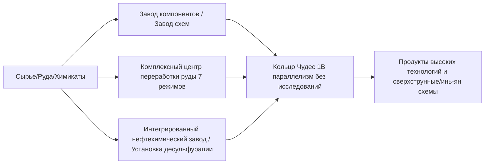

# GTECore Мультиблочные машины — Энциклопедия

GTECore создан для решения проблем громоздких технологических цепочек на поздних этапах технической линии, предлагая множество мультиблочных машин, сочетающих **экстремально высокий параллелизм** и **агрегированную логику производства**.

---

## 🏭 Крупные мультиблоки паровой эры

Для решения проблем низкой производительности и избыточности занимаемой площади в паровую эру GTECore представляет серию крупных паровых мультиблоков, все из которых поддерживают кросс-рецептурный параллелизм и высокую пропускную способность пара:

| Название машины (Block ID) | Основная функция и типы рецептов | Особенности и преимущества |
| :--- | :--- | :--- |
| **Большая паровая сплавочная печь** (`gtceu:big_alloy`) | Выплавка сплавов (`alloy_smelter`) | Высокопроизводительное производство сплавов на ранних этапах, поддержка пара высокого давления |
| **Большой паровой компрессор** (`gtceu:big_compressor`) | Обработка сжатием (`compressor`) | Массовое прессование плотных металлических пластин и блоков |
| **Большой паровой ковочный молот** (`gtceu:big_forge_hammer`) | Ковка/дробление в порошок и пластины (`forge_hammer`) | Автоматизированное быстрое дробление пластин и сырой руды |
| **Большой паровой экстрактор** (`gtceu:big_steam_extractor`) | Экстракция резины/жидкостей (`extractor`) | Масштабная экстракция древесной смолы и промышленных жидкостей |
| **Простая паровая дробилка** (`gtceu:steam_grinder_easy`) | Измельчение руды (`macerator`) | Многократная переработка минералов на ранних этапах |
| **Простая паровая обжиговая печь** (`gtceu:steam_oven_easy`) | Пиролиз и плавка (`pyrochlore_oven`) | Промышленное массовое производство кокса и древесного угля |
| **Паровой завод по переработке руды** (`gtecore:steam_op`) | Комплексное дробление и очистка руды | **Параллелизм 1 миллиард (1B)**, все рецепты выполняются за **1 тик**! Поддержка любых входных/выходных модулей |

---

## ⚡ Суперэлектрические промышленные мультиблоки

С наступлением электрической эры GTECore предлагает многофункциональные и высокоуровневые обрабатывающие центры:

### 1. Основные производственные заводы

- **§6Завод компонентов (`gtceu:component_factory`)**：
  - **Назначение**：Производство двигателей, насосов, поршней, манипуляторов, конвейерных лент, светодиодов и других распространенных базовых компонентов за один шаг.
  - **Особенности**：Позволяет пропустить утомительные промежуточные подпроцессы, обеспечивая сверхбыстрое производство стандартных промышленных деталей заданного уровня напряжения.
- **§6Завод схем (`gtceu:circuit_factory`)**：
  - **Назначение**：Объединение производства интегральных схем, травления чипов и корпусирования в одном устройстве.
  - **Особенности**：Поддержка кросс-рецептурных параллельных модулей, полное ускорение производства плат на всем диапазоне напряжения от ULV до MAX.
- **§6Кольцо Чудес (`gtceu:miracle_ring`)**：
  - **Назначение**：Промышленное чудо — финальное сборочное сооружение.
  - **Особенности**：Обладает **параллелизмом 1 миллиард (1B)** и **разгоном 1t Subtick**, **не требует проведения каких-либо исследований/исследований сборочной линии** для выполнения рецептов сборочной линии!
- **Химический Терминатор (`gtecore:chemistry_terminator`)**：
  - **Назначение**：«Ниспровергает существование химии и физики, олицетворяя конец химии».
  - **Особенности**：Агрегирует сложные многоступенчатые химические реакции в один клик, обеспечивая сверхбыстрый синтез различных конечных полимеров и кислотных сред.
- **Универсальный завод «Десять в одном» (`gtecore:ten_in_one`)**：
  - **Назначение**：Универсальный интегрированный блок, объединяющий 10 основных процессов: центрифугирование, электролиз, химическое выщелачивание, полимеризацию, реакции под высоким давлением и другие.

### 2. Система очистки руды и жидкостей

- **§6Комплексный центр переработки руды (`gtecore:ore_process_center`)**：
  - Поддержка **7 режимов программируемых схем**, обеспечивающих 5–8-кратное обогащение минералов с различным выходом продукции (полная интеграция дробления, промывки, термического разделения, центрифугирования и электромагнитной сепарации), поддержка разгона 1t Subtick.
- **Интегрированный нефтехимический завод (`gtecore:integrated_petrochemical_plant`)**：
  - Объединяет весь цикл: фракционирование сырой нефти, каталитический крекинг, риформинг и десульфурацию. Одна машина производит все легкие углеводородные газы и ароматические углеводороды.
- **Установка десульфурации (`gtceu:desulfurization`)**：
  - Быстрая очистка различных тяжелых сернистых видов топлива с рекуперацией высокочистого порошка серы в качестве побочного продукта.
- **Простая/Продвинутая буровая установка для жидкостей (`gtecore:easy_fluid_drilling_rig` / `not_hard_fluid_drilling_rig`)**：
  - Автоматическая добыча жидкости из базальтовых жил, неиссякаемый источник, не требует сложной разведки трубопроводов.

### 3. Высокотехнологичная и сверхпроводящая обработка кабелей

- **§6Завод проводов (`gtecore:wiremill_factory`)**：Одним нажатием производит все металлические провода: одножильные, двужильные, четырехжильные, восьмижильные, шестнадцатижильные, а также сверхпроводящие кабели.
- **§6Кристаллический центр (`gtecore:crystal_center`)**：Масштабное автоматизированное выращивание монокристаллических кремниевых стержней, изумрудов, сапфиров и заряженных кристаллов Секстэля.
- **§6Квантовый кабельный сборщик (`gtecore:quantum_cable_assembler`)**：Специализирован для высокоскоростного производства квантового оптоволокна и кабелей передачи энергии через измерения.
- **§3Травильная машина «Звёздный клинок» (`gtecore:starblade_etching_machine`)**：Использует высокоэнергетические пучки в экстремальном ультрафиолетовом/рентгеновском диапазоне для травления галактических микро- и наночипов.

---

## 🔋 Энергетика и генераторные системы

| Название машины | Выход энергии/Уровень | Основной механизм и характеристики |
| :--- | :--- | :--- |
| **§6Универсальный топливный двигатель** (`gtceu:general_fuel_engine`) | Динамическая адаптация (максимум MAX) | **Поддерживает все типы топлива в мире** (дизель, биомасса, природный газ, ракетное топливо и т.д.), обладает **параллелизмом 2 миллиарда (2B)**, высвобождая колоссальное количество энергии в мгновение ока! |
| **Большой универсальный генератор** (`gtecore:large_general_generator`) | Многоуровневое напряжение на выбор | Совместим с обычными роторами газовых, паровых и плазменных генераторов |
| **Супертермоядерный реактор** (`gtecore:super_fusion_reactor`) | Выход термоядерной плазмы | Полностью устраняет длительное ожидание нагрева обычного термоядерного синтеза, **идеально поддерживает разгон 1T Subtick**, мгновенно выдает высокотемпературные продукты синтеза |
| **Супер аккумуляторный буфер MAX** (`gtecore:max_super_battery_buffer_1x`) | **MAX (2,147,483,647 В)** | Вмещает огромный объем буфера EU, поддерживает беспроводной интерфейс зарядки между измерениями с нулевыми потерями |