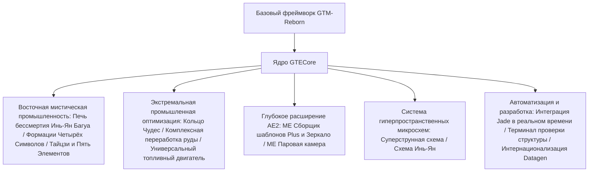

# Обзор ядра мода GTECore

**GTECore** — это кастомное Java-ядро мода для проекта GregTech Easy. Оно напрямую зависит от исходного кода `gtm-reborn` и расширяет его масштабными многоструктурными промышленными механизмами, высокоуровневыми формационными технологиями, глубоким взаимодействием с AE2 и супер-системой производства микросхем.

---

## 🏛️ Архитектура мода и дизайн-позиционирование

---

## 📦 Вкладка творческого режима и категории

GTECore регистрирует отдельную вкладку творческого режима в игре:

1. **Машины GregTech Easy (`itemGroup.gtecore.gtecore_machines`)**:
   - Содержит все оригинальные многоструктурные блоки GTE (Высокопечь Инь-Ян Багуа, Кольцо Чудес, Центр переработки руды, Химический терминатор и т.д.).
   - Содержит многоуровневые супер-батарейные блоки (Max Super Battery Buffer), ME Паровую камеру, ME Сборщик шаблонов Plus и Зеркало.
2. **Предметы GregTech Easy (`itemGroup.gtecore.gtecore_items`)**:
   - Содержит предметы серии суперструнных и инь-ян микросхем (процессоры, кластеры, суперкомпьютеры, хосты).
   - Содержит талисманы пяти элементов, чипы Багуа, частицы Саньцин, терминал проверки структуры и другие специальные предметы.

---

## ⚙️ Глобальная конфигурация мода (`GTEConfig`)

GTECore предоставляет обширные параметры конфигурации в игре и в файлах (находятся в `config/gtecore-common.toml` или в меню конфигурации в игре):

| Параметр | Значение по умолчанию | Подробное описание |
| :--- | :--- | :--- |
| `superPeace` (Режим супер-мира) | `false` | При включении полностью отключает генерацию враждебных мобов, обеспечивая абсолютно чистую среду для технологического строительства |
| `durationMultiplier` (Множитель времени рецептов) | `1.0` | Глобально регулирует множитель времени для пользовательских рецептов GTECore |

---

## 🔍 Встроенная интеграция Jade / TOP

GTECore включает встроенную поддержку плагина **`GTEJadePlugin`**:
- **Статус ME Сборщика шаблонов Plus**: отображает в реальном времени количество привязанных шаблонов, режимы вывода жидкостей и предметов.
- **Информация о привязке Зеркала ME Сборщика шаблонов Plus**: при наведении напрямую показывает координаты `(X, Y, Z)` основного сборщика и статус сетевого подключения.
- **Индикатор активации формации**: на Печи бессмертия Инь-Ян Багуа в реальном времени отображает статус готовности формаций Четырёх Символов: Зелёный Дракон, Белый Тигр, Красная Птица и Чёрная Черепаха.

---

## 🛠️ Терминал проверки структуры (`Structure Testing Terminal`)

GTECore предоставляет специальный ручной инструмент — **Терминал проверки структуры** (`item.gtecore.check_structure_terminal`):
- **ПКМ по контроллеру многоструктурной машины**: сканирует целостность структуры в реальном времени.
- **Сообщения об ошибках диагностики**: если структура не сформирована, терминал точно указывает **координаты ошибочных блоков и места, которые не должны быть заняты**, в чате и всплывающей подсказке, что значительно ускоряет строительство и устранение неполадок больших многоструктурных машин.