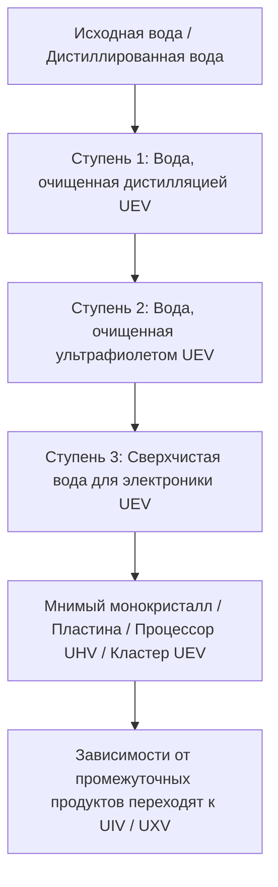

# Трёхступенчатая очистка воды и промышленный водяной контур

В GTECore **вся трёхступенчатая система очистки воды относится к уровню UEV**. Ступени обозначают последовательные процессы обработки и качество воды, а не разные эпохи напряжения. Центральная установка, все три очистных блока и их управляющие люки используют компоненты и схемы UEV, а также напряжение сборки UEV. Все три этапа очистки и регенерация EDI работают на UEV.

Линия состоит из **одной центральной установки и трёх очистных блоков**. У блоков нет энергетических люков: свяжите их с центральной установкой с помощью носителя данных, чтобы они получали питание и ограничение числа параллельных рецептов.

## 💧 Характеристики воды трёх ступеней очистки

| Зарегистрированная жидкость | Название материала | Технологический уровень |
| :--- | :--- | :---: |
| `distilled_purified_water` | Вода, очищенная дистилляцией | UEV |
| `uv_purified_water` | Вода, очищенная ультрафиолетом | UEV |
| `ultrapure_water` | Сверхчистая вода для электроники | UEV |

Описания промышленного качества воды служат справочной информацией; фактическое поведение в игре определяется рецептами, термической стабильностью, дозой УФ-излучения и нагрузкой EDI.

## 🏭 Четыре мультиблочные машины

| Машина | Идентификатор реестра | Технологический уровень |
| :--- | :--- | :---: |
| Центральная установка очистки воды | `central_water_purification_plant` | UEV |
| Блок осветления и очистки первой ступени | `t1_clarifier_purification_unit` | UEV |
| Блок очистки УФ-окислением второй ступени | `t2_uv_oxidation_purification_unit` | UEV |
| Блок сверхчистой очистки EDI третьей ступени | `t3_edi_ultrapure_purification_unit` | UEV |

Старая `ultrapure_water_refinery` остаётся зарегистрированной для совместимости, но отключена. Она больше не может выполнять полную цепочку очистки; перейдите на центральную установку и три блока.

### 1. Центральная установка очистки воды

Центральная установка не выполняет рецепты очистки. Она хранит связи, распределяет энергию между подключёнными блоками с собранной структурой, показывает фактическую выдаваемую мощность в EU/s и передаёт настроенное ограничение числа параллельных рецептов. Блок не может работать без подключённой центральной установки с собранной структурой.

### 2. Ступень 1: осветление и термическая обработка (UEV)

Первая ступень отделяет примеси от поступающей воды. Номинальные параметры рецептов:

- Вода 1000 mB + Композитный флокулянт 50 mB + 1 Модифицированная углеродная микросфера → Вода, очищенная дистилляцией, 900 mB / 60 тиков, с вероятностью получения соляной и редкоземельной пыли.
- Дистиллированная вода 1000 mB + Композитный флокулянт 25 mB + 1 Модифицированная углеродная микросфера → Вода, очищенная дистилляцией, 1000 mB / 30 тиков, с вероятностью получения соляной пыли.

Фактический выход воды также зависит от термической стабильности. Это начало цепочки очистки уровня UEV.

### 3. Ступень 2: окисление глубоким ультрафиолетом (UEV)

УФ-излучение и окислители разлагают органические примеси. Номинальные параметры рецептов:

- Вода, очищенная дистилляцией, 800 mB + Озон 50 mB → Вода, очищенная ультрафиолетом, 800 mB + Кислород 25 mB / 40 тиков.
- Вода, очищенная дистилляцией, 800 mB + Пероксид водорода 50 mB → Вода, очищенная ультрафиолетом, 800 mB + Кислород 25 mB / 20 тиков.

Для завершения обоих процессов также необходимо набрать требуемую дозу УФ-излучения.

### 4. Ступень 3: электродеионизация и финишная очистка (UEV)

Ступень EDI удаляет остаточные ионы. В игре для её работы нужны реагент и смола; отдельный рецепт регенерации снимает накопленную ионную нагрузку:

- Вода, очищенная ультрафиолетом, 800 mB + Кислотно-основный реагент для электроники 20 mB + 1 Гранула смолы смешанного слоя → Сверхчистая вода для электроники 800 mB / 30 тиков.
- Регенерация EDI: Вода, очищенная ультрафиолетом, 100 mB + Кислотно-основный реагент для электроники 1 mB / 2 тика. Она снимает ионную нагрузку, но не производит воду.

## 🔌 Подключение и эксплуатация линии

1. Удерживая клавишу приседания, нажмите правой кнопкой мыши по центральной установке с носителем данных GT в руке, чтобы скопировать её координаты.
2. Нажмите правой кнопкой мыши по очистному блоку с этим носителем, чтобы связать его с установкой. Обратный порядок также работает: скопируйте координаты блока, затем нажмите правой кнопкой мыши по центральной установке.
3. Подайте питание на центральную установку через энергетические люки (1–4; поддерживается лазерный ввод). Установка передаёт энергию подключённым блокам.
4. Задайте в интерфейсе установки ограничение числа параллельных рецептов от 1 до 65536.
5. Проверьте в интерфейсе каждого блока координаты подключённой установки, ограничение параллельной обработки и внутренний энергетический буфер.

Каждый блок потребляет мощность рецепта, умноженную на фактическое число параллельно выполняемых рецептов. У всех трёх блоков одинаковый предел мощности: `напряжение UEV × 256 A`. Ступени 1, 2 и 3 обозначают процессы обработки, а не разные рабочие напряжения или уровни разблокировки. Фактическая параллельность также зависит от наличия ингредиентов и свободной ёмкости выхода, поэтому одно лишь повышение общего ограничения не гарантирует рост производительности.

## 🔄 Мнимое производство и порядок запуска

Следующие рецепты Древа мнимого напрямую потребляют `ultrapure_water` третьей ступени. Количества указаны на один цикл рецепта:

| Продукт | Выход за цикл | Вода для электроники |
| :--- | ---: | ---: |
| Мнимый монокристалл | 4 | 4000 mB |
| Обычная мнимая пластина | 16 | 1000 mB |
| Мнимый процессор UHV | 4 | 1000 mB |
| Кластер мнимых процессоров UEV | 2 | 2000 mB |

Мнимый суперкомпьютер UIV и мнимый мэйнфрейм UXV напрямую не потребляют дополнительную воду. Они наследуют зависимость от неё через необходимые кластеры и компьютеры. Уровень схемы готового продукта и напряжение его рецепта не меняют того, что система очистки становится доступна на этапе UEV.

Порядок запуска: **компоненты UHV + производство инь-ян → восемь компонентов UEV → очистное оборудование UEV → вода третьей ступени для электроники → ключевые мнимые продукты**. Сборка добавляет рецепты восьми компонентов UEV. Рецепты инь-ян и этих компонентов не требуют воду для электроники напрямую, что исключает замкнутую зависимость, при которой для создания очистного оборудования уже нужен его собственный продукт.

Мнимые строительные материалы, путь к первому древу и производство монокристаллов и обычных пластин образуют связанную цепочку; см. [Мнимые материалы и первое древо](circuits-and-materials.md). Ядро Дао красного солнца потребляет 4000 mB воды для электроники за цикл, производя 32 единицы питательной среды. Листовые матрицы остаются структурными блоками, тогда как производство монокристаллов постоянно расходует питательную среду.

**Мнимый центр иммерсионной литографии** потребляет воду третьей ступени для электроники и обрабатывает обычные мнимые пластины по собственным специализированным рецептам. Для пластин CPU, необработанных чипов, гравированных чипов, чипов схем и чипов CPU теперь существуют связанные производственные цепочки, все на UEV. Прямой расход воды за цикл составляет соответственно **2000, 1000, 500, 1000 и 500 mB**. Экспонирование и гравировка используют многоразовую стеклянную линзу инь-ян, которая не расходуется. Обе ветви и полные количества ингредиентов описаны в разделе [Мнимый центр иммерсионной литографии](circuits-and-materials.md). Его контроллер можно собрать из схем инь-ян UIV и обычных мнимых пластин, не используя чипы, производимые самим центром.

### Фабрика мнимых схем

Для запуска [Фабрики мнимых схем](circuits-and-materials.md) нужны чипы CPU и чипы схем из центра литографии, схемы UIV предыдущего поколения и компоненты UEV. Её собственные платы или SoC для первоначального запуска не требуются. Все три процесса используют UEV:

| Продукт процесса | Выход за цикл | Прямой расход воды для электроники | Базовая длительность |
| :--- | ---: | ---: | ---: |
| Подложка схемы Мнимого древа | 4 | 2000 mB | 30 s |
| Печатная плата Мнимого древа | 1 | 1000 mB | 20 s |
| SoC Мнимого древа | 2 | 2000 mB | 30 s |

Цепочка рецептов теперь связывает подложки, печатные платы, SoC и все четыре уровня готовых схем. Древо мнимого по-прежнему производит четыре готовые схемы при **производственном напряжении UEV**, с выходом **4 / 2 / 1 / 1** за цикл. Их **теги схем UHV / UEV / UIV / UXV** остаются неизменными. UIV и UXV наследуют расход воды через промежуточные продукты.

Переработка воды с понижением её качества в установке травления звёздным клинком и на фабрике схем, дополнительный выход при обработке руды и контур с возвратом 90% воды остаются нереализованными предложениями, а не доступными функциями.
