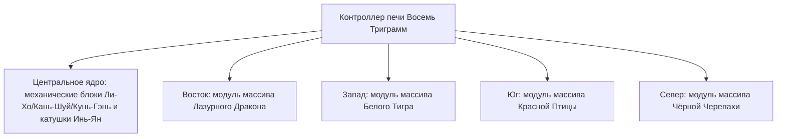

# Система алхимической печи «Инь-Ян Восемь Триграмм» и массив Четырёх Символов

GTECore представляет уникальную **«Систему Тайцзи Восьми Триграмм и Четырёх Символов»**, сочетающую восточную даосскую философию с современной тяжёлой промышленной инженерией. Эта система является центральным узлом для металлургии, синтеза сверхпроводящих материалов и технологического скачка в бессмертных технологиях на средней и поздней стадиях игры.

---

## 🌌 Алхимическая печь «Инь-Ян Восемь Триграмм» (`yin_yang_eight_trigmas_blast_furnace`)

**Печь «Цзывэй Восемь Триграмм»** — одна из самых масштабных и точных по механике многоструктурных конструкций в мире модов на технику (занимает более 55×55 блоков):



### 🧭 Правило ориентации по фэн-шуй (ключевой механизм)
> [!ВАЖНО]
> **Закон фэн-шуй и направлений**: из-за ограничений фэн-шуй и магнитного поля **главный контроллер печи должен быть установлен лицевой стороной строго на юг**, чтобы соединиться с энергией Инь-Ян неба и земли и корректно сформироваться и работать!

### Базовые возможности печи
- **Поддержка рецептов**: нативно совместима с обычными рецептами доменной печи (`blast_recipes`), рецептами плавильной печи (`furnace_recipes`), рецептами сплавной печи (`alloy_smelter_recipes`), рецептами гигантской сплавной домны GCYM (`alloy_blast_recipes`) и эксклюзивными **рецептами Инь-Ян Восьми Триграмм (`yin_yang_eight_trigmas_blast`)**.
- **Особенности разгона**: полная поддержка **мгновенного разгона 1T Subtick** и **пакетного режима (Batch Mode)**.

---

## 🐉 Подмодули массива Четырёх Символов и динамическое обнаружение условий

Вокруг печи можно расширить четыре крыла массива: **Восточный Лазурный Дракон, Западный Белый Тигр, Южная Красная Птица, Северная Чёрная Черепаха**:

| Модуль массива | Направление массива | Блоки массива | Условие рецепта (`RecipeCondition`) | Бонусы и эффекты при активации |
| :--- | :--- | :--- | :--- | :--- |
| **Массив Лазурного Дракона** (`Qing Long`) | **Восток (East)** | `qinglong_module` | `QING_LONG_CONDITION` | Активирует силу «дерево порождает огонь», значительно снижает энергопотребление при сверхвысокотемпературной плавке, открывает бесконечные высокоуровневые каталитические рецепты |
| **Массив Белого Тигра** (`Bai Hu`) | **Запад (West)** | `baihu_module` | `BAI_HU_CONDITION` | Металлическая энергия разрушения, открывает рецепты расщепления сверхтвёрдых божественных металлов, сверхплотных тяжёлых ядерных элементов и квантового превращения металлов |
| **Массив Красной Птицы** (`Zhu Que`) | **Юг (South)** | `zhuque_module` | `ZHU_QUE_CONDITION` | Южный огонь, обеспечивает неограниченную максимальную температуру печи, открывает рецепты плазменной плавки звёздного уровня и алхимии божественных пилюль |
| **Массив Чёрной Черепахи** (`Xuan Wu`) | **Север (North)** | `xuanwu_module` | `XUAN_WU_CONDITION` | Вода Кань, обеспечивает сверхбыстрое охлаждение сверхвысокотемпературных продуктов, открывает рецепты мгновенного затвердевания и стабилизации антиматерии |

### Динамическое обнаружение и обратная связь состояния
- Контроллер при каждом сканировании структуры и сопоставлении рецептов автоматически вызывает `checkModule()` для проверки готовности блоков массива по четырём смещённым координатам.
- При наведении на контроллер с помощью **Jade** можно наглядно увидеть текущее состояние активации всех четырёх массивов (зелёный — активирован, красный — не готов).

---

## 🔮 Производные ядра Дао и матрица звёздных скоплений

На основе печи Восьми Триграмм GTECore дополнительно расширяет серию многоструктурных конструкций небесного Дао:

```
Промышленный комплекс высокого уровня GTE
├── Массив разделения пяти элементов Тайцзи (Tai Chi Five Elements Separation Array)
├── Звёздный узел Кунь-Гэнь (Kun Gen Star Hub)
├── Двигатель Цянь-Цюн (Qian Qiong Engine)
├── Ядро Дао Красного Солнца (Red Sun Tao Core)
└── Массив термоядерного синтеза Пепельной Звезды (Ashing Star Fusion Array)
```

1. **Массив разделения пяти элементов Тайцзи (`taichi_five_elements_separation_array`)**:
   - Разделяет и анализирует любые минералы и химические вещества из реальности и фантастики на чистые первоэлементы **металл, дерево, вода, огонь, земля**.
2. **Звёздный узел Кунь-Гэнь (`kun_gen_star_hub`)**:
   - Связывает гравитационные волны земли и звёзд, используется для сбора микроскопических гравитонов и создания микроскопических чёрных дыр.
3. **Двигатель Цянь-Цюн (`qian_qiong_engine`)**:
   - Двигатель, извлекающий энергию из пустоты, получает необъятную энергию вакуума из квантовых флуктуаций.
4. **Ядро Дао Красного Солнца (`red_sun_tao_core`)**:
   - Искусственное сверхминиатюрное ядро звезды, моделирующее экстремальные физические условия короны звезды с температурой в триллионы градусов.
5. **Массив термоядерного синтеза Пепельной Звезды (`ashing_star_fusion_array`)**:
   - Матрица аннигиляционного синтеза остатков сверхновых, используется для восстановления баланса тёмной материи и антиматерии.