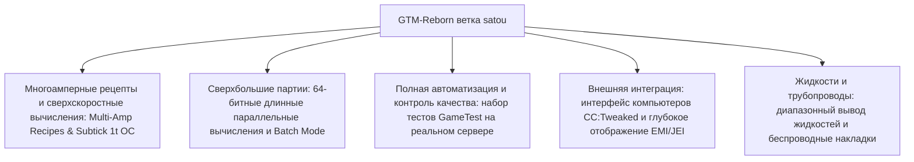

# GregTech Modern Reborn (GTM Reborn)

`modules/gtm-reborn` — это независимая ветка GregTech Modern, глубоко настроенная GTE-Multi (ветка называется `satou`).

---

## 🚀 Ключевые улучшения ветки `satou`

По сравнению с оригинальной версией, GTM-Reborn реализует множество революционных технических улучшений и обновлений промышленного опыта в современной версии Minecraft 1.20.1:



### 1. 64-битные длинные целые параллельные вычисления и пакетный режим (Batch Mode)
- **Преодоление 32-битного целочисленного предела**: параллельные вычисления полностью используют тип данных `long`, что полностью решает проблемы переполнения или усечения чисел при очень высоком параллелизме в сверхбольших промышленных группах.
- **Интеллектуальный пакетный режим**: когда сырья очень много, машина может упаковать сотни и тысячи мелких рецептов в один цикл, что значительно снижает нагрузку на тики сервера.

### 2. Мгновенный разгон 1T Subtick (OC_PERFECT_SUBTICK)
- Оптимизирован конвейер выполнения Recipe Logic машины, что позволяет указанным продвинутым машинам выполнять несколько итераций рецептов за 1 тик, раскрывая чистый предел промышленного производства.

### 3. Многоамперный ввод и поддержка рецептов (Multi-Amp)
- Рецепты машин поддерживают потребление/вывод нескольких ампер (Amperes) на один рецепт, а интерфейсы EMI/JEI наглядно отображают значения многоамперности и подсказки по спецификации проводов.

### 4. Диапазонный вывод жидкостей (Ranged Fluid Outputs)
- Позволяет высокоуровневым дистилляционным колоннам и химическим реакторам выводить жидкие продукты с плавающим диапазоном в зависимости от различных температур и давлений.

### 5. Современная интеграция периферии CC:Tweaked (ComputerCraft)
- Все стандартные машины открывают периферийные интерфейсы для ComputerCraft:
  - Запрос в реальном времени прогресса рецепта, оставшегося времени, текущего потребления EU/t.
  - Динамическое включение, пауза машин или переключение режимов работы через Lua-скрипты.

---

## 🧪 Автоматизированное тестирование и проверка GameTest

GTM-Reborn включает полный набор автоматизированных тестов GameTest нативного Minecraft (находится в `src/test`):

```powershell
# Запуск автоматизированного серверного теста GameTest
$env:JAVA_HOME='C:\Users\Ex_Je\.jdks\ms-21.0.11'
.\gradlew.bat :modules:gtm-reborn:runGameTestServer
```

### Область покрытия тестами
- **Система Cover**: тестирование пропускной способности и логики защиты от утечек для жидкостных насосных панелей, панелей передачи предметов и панелей направления энергии.
- **Recipe Logic машин**: тестирование многоамперности, пакетной обработки, параллельных вычислений между рецептами и расчетов разгона.
- **Формирование и вращение мультиблоков**: тестирование структурной проверки различных корпусов и отсеков при разных ориентациях.

---

## 🌿 Правила рабочего процесса Git для подмодуля

`modules/gtm-reborn` соответствует отдельному Git-репозиторию `takanashisatou/GregTech-Modern-Reborn`, ветка разработки по умолчанию — `satou`:

```bash
# Разработка и коммиты независимо в подмодуле
cd modules/gtm-reborn
git checkout satou
git add .
git commit -m "feat: optimize multiblock recipe logic"
git push origin satou

# Возврат в основной проект для обновления указателя подмодуля
cd ../..
git add modules/gtm-reborn
git commit -m "chore: bump gtm-reborn submodule pointer"
```