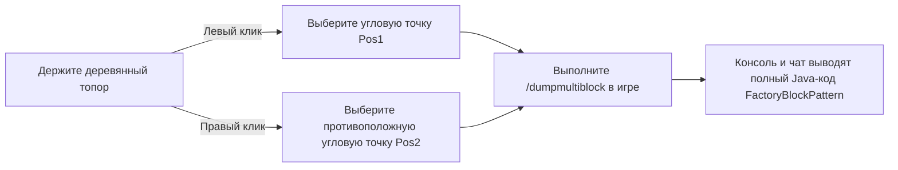

# KubeJS Инструменты и экспортер мультиблоков (`/dumpmultiblock`)

GTE встроил в серверные скрипты KubeJS специальные инструменты для автоматического построения и извлечения структур мультиблоков, полностью освобождая процесс проектирования мультиблоков.

---

## 🪓 Визуальный экспортер мультиблоков (`/dumpmultiblock`)

При разработке пользовательских мультиблоков (будь то Java-код или скрипты KubeJS) ручное написание `FactoryBlockPattern.aisle(...)`, состоящего из десятков слоев символов, крайне трудоемко и подвержено ошибкам.

GTE включает в себя **экспортер выделения деревянным топором `/dumpmultiblock`** (`server_scripts/easymultiblock.js`):



### Шаги использования

1. Войдите в творческий режим и возьмите **деревянный топор (`minecraft:wooden_axe`)**.
2. Постройте в мире полную физическую структуру мультиблока в соответствии с задумкой (включая корпус, отсеки, катушки, главный контроллер).
3. Используйте деревянный топор **левым кликом** по одному из нижних угловых блоков структуры (в чате появится сообщение `Установлена Pos1: x, y, z`).
4. Используйте деревянный топор **правым кликом** по противоположному верхнему угловому блоку структуры (в чате появится сообщение `Установлена Pos2: x, y, z`).
5. Введите команду в чат:
   ```mcfunction
   /dumpmultiblock
   ```
6. Скрипт автоматически сканирует все типы блоков в трёхмерной ограничивающей рамке, назначает символьные отображения (`.` — воздух, `A-Z/a-z/0-9` — конкретные блоки) и генерирует код структуры в фоновом журнале и на клиенте:

```java
// Автоматически экспортированный шаблон FactoryBlockPattern
.pattern(definition -> FactoryBlockPattern.start()
    .aisle("BBB", "BBB", "BBB")
    .aisle("BBB", "BAB", "BBB")
    .aisle("BBB", "B#B", "BBB")
    .where('A', Predicates.blocks("minecraft:air"))
    .where('#', Predicates.controller(Predicates.blocks(definition.getBlock())))
    .where('B', Predicates.blocks("gtceu:steam_machine_casing").or(Predicates.autoAbilities(definition.getRecipeTypes())))
    .build()
)
```

---

## 🌌 Конфигурация газов и жидкостных руд в измерениях

GTE расширяет сбор жидкостей и газов по всем измерениям через KubeJS:

### 1. Извлечение газов во всех измерениях (`dimension_gas.js`)
Используя большую газосборную камеру (`gas_collector`) с различными номерами схем, можно извлекать уникальную атмосферу измерения в любом измерении:
- **Воздух Верхнего мира**: `circuit(4)` ➜ вывод `gtceu:air 10000`
- **Адский воздух Нижнего мира**: `circuit(5)` ➜ вывод `gtceu:nether_air 10000`
- **Воздух Пустоты Края**: `circuit(6)` ➜ вывод `gtceu:ender_air 10000`

### 2. Универсальный преобразователь схем (`universal_circuit.js`)
Для решения проблемы сложного наложения рецептов между модами и схемами разных уровней, GTE вводит систему **универсальных схем (`universal_circuit`)**:
- Позволяет в упаковщике (`packer`) конвертировать любые схемы одного уровня напряжения (от ULV до MAX) в единый универсальный предмет схемы без потерь со скоростью **1 EU / 1 tick**.