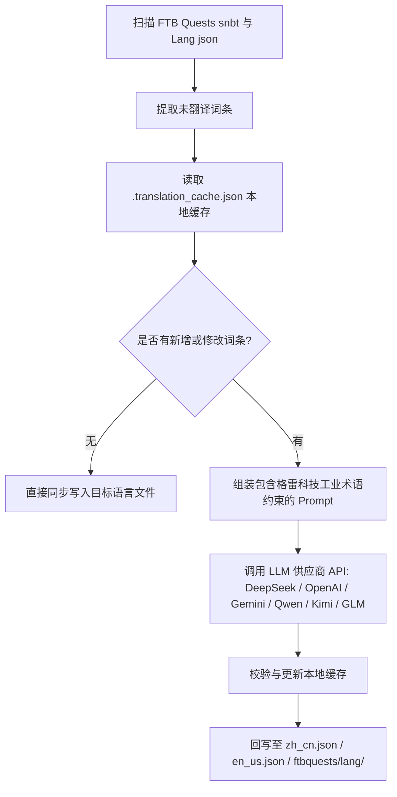

# AI 國際化翻譯引擎 (`opencode_translate.py`)

GTE 工程設計並實現了基於現代大語言模型（LLM）的跨模組全自動國際化翻譯系統（位於 `scripts/opencode_translate.py`）。

---

## 🤖 翻譯引擎架構

傳統的社群漢化依賴人工手動維護繁雜的 JSON 與 SNBT 文字，更新滯後且極易產生錯漏。

GTE 的 AI 翻譯引擎透過標準化 OpenAI 相容 API，實現了 FTB Quests 任務書與核心 Mod 語言檔案的**自動化增量提取、術語對齊與併發翻譯**：



---

## 🔑 支援的 LLM 供應商與環境變數

指令碼支援透過環境變數無縫切換不同的 AI 模型提供商：

| 供應商名稱 | API Key 環境變數 | Base URL 環境變數 | 預設模型 |
| :--- | :--- | :--- | :--- |
| **DeepSeek** | `DEEPSEEK_API_KEY` | `DEEPSEEK_BASE_URL` | `deepseek-chat` |
| **OpenAI** | `OPENAI_API_KEY` | `OPENAI_BASE_URL` | `gpt-4o-mini` |
| **Google Gemini** | `GEMINI_API_KEY` | `GEMINI_BASE_URL` | `gemini-3.5-flash` |
| **通義千問 (DashScope)** | `DASHSCOPE_API_KEY` | `DASHSCOPE_BASE_URL` | `qwen-plus` |
| **月之暗面 (Moonshot)** | `MOONSHOT_API_KEY` | `MOONSHOT_BASE_URL` | `moonshot-v1-8k` |
| **智譜清言 (Zhipu GLM)** | `ZHIPU_API_KEY` | `ZHIPU_BASE_URL` | `glm-4-flash` |
| **OpenCode 平臺** | `OPENCODE_API_KEY` | `OPENCODE_BASE_URL` | `deepseek-v4-flash` |
| **通用聚合代理** | `LLM_API_KEY` | `LLM_BASE_URL` | `LLM_MODEL` (自定義) |

---

## 🎯 工業級 Prompt 約束原則

在呼叫 API 進行翻譯時，系統內建了嚴格的 Minecraft 與 GregTech 術語規則：
1. **格式符絕對保留**：完整保留 Minecraft 原生顏色格式化程式碼（如 `§a`, `§c`, `§6`）與佔位符（`%s`, `%d`, `{0}`）。
2. **科技術語規範統一**：嚴格鎖定科技專有名詞翻譯（如 `UHV`, `EU/t`, `Amps`, `Voltage`, `Overclock`, `Subtick` 等）。
3. **雜湊增量快取**：所有已翻譯條目自動持久化記錄在 `.translation_cache.json` 中，只有新增或變更文字會發起網路請求，極大節省 Token 開銷與 CI 耗時。

---

## 💻 本地執行指令

在本地開發環境中一鍵觸發全量翻譯：

```powershell
# 设置任意一个有效 API Key 后执行
$env:DEEPSEEK_API_KEY="sk-..."
python scripts/opencode_translate.py
```
