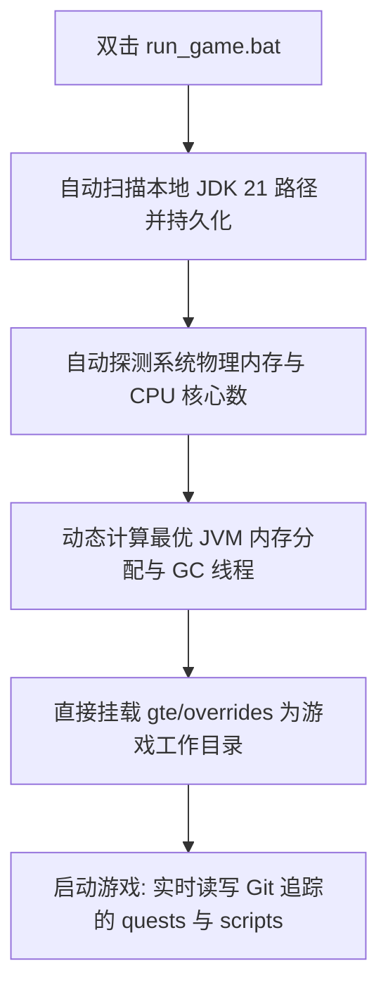

# 本地熱聯調與免啟動器快速執行

GTE 設計了一套對整合包策劃、任務編寫者與模組程式設計師極其友好的無感聯調系統。

---

## ⚡ 1. 免啟動器極速啟動指令碼 (`run_game.bat` / `run_game.sh`)

對於任務書作者（FTB Quests）和 KubeJS 配方策劃人員，**無需開啟 IntelliJ IDEA，也無需安裝任何第三方啟動器**，直接雙擊專案根目錄下的 **`run_game.bat`** 即可極速進入遊戲！



### 核心特性
1. **全自動 JDK 21 探測**：自動檢索 `.jdks`、`Adoptium`、`Zulu`、`Program Files` 下安裝的 Java 21，並自動記憶於 `.jdk_path`。
2. **硬體自適應最佳化**：根據當前電腦的 RAM 總量自動按最優比例（50%~60% 可用實體記憶體）分配 JVM 堆大小，自動配置並行 GC 執行緒。
3. **零挪動工作流**：遊戲內修改任務（`/ftbquests editing_mode true`）並儲存，修改直接實時儲存在 Git 倉庫對應的 `config/ftbquests/` 中，開啟 GitHub Desktop 即可一鍵提交！

---

## 🔗 2. 外部啟動器零複製對映工具 (`link_to_launcher.bat`)

如果你習慣使用自己配置好皮膚、按鍵習慣的啟動器（如 PCL2 / HMCL / Prism Launcher）：

1. 雙擊執行根目錄的 **`link_to_launcher.bat`**。
2. 按提示將你的啟動器遊戲目錄（例如 `D:\PCL2\.minecraft\versions\GTE-Dev\.minecraft\`）拖入控制檯中並回車。
3. 指令碼會自動建立 Windows 目錄軟連結 (Directory Junctions)：
   - `config` ➜ `gte/overrides/config`
   - `kubejs` ➜ `gte/overrides/kubejs`
   - `ftbquests` ➜ `gte/overrides/config/ftbquests`
   - `defaultconfigs` ➜ `gte/overrides/defaultconfigs`
4. 無論在啟動器中如何修改任務或配方，**物理資料實時同步儲存在主 Git 倉庫中**！

---

## ☕ 3. 模組程式碼熱編譯影子環境 (`gte-dev-runtime`)

對於 Java/Kotlin 程式設計師，`modules/gte-dev-runtime` 是專用的影子除錯模組：

### 工作原理與設計考量
- **定位**：純本地熱編譯聯調沙盒，**禁止打包釋出，不會出現在任何玩家構件中**。
- **ModDevGradle 動態重對映**：自動將 `gtm-reborn` 與 `gtecore` 的最新原始碼熱編譯並掛載進 Mojang 反混淆名稱空間。
- **啟動方式**：
  - 在 IDEA 中選擇執行配置 **`Run GTE Full Pack (Client - Hot Debug)`**。
  - 或命令列執行：
    ```powershell
    .\gradlew.bat :modules:gte-dev-runtime:runClient
    ```
