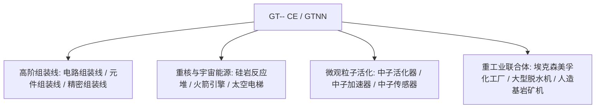

# GT-- Community Edition (GTNN)

`modules/gt--` (包名 `dev.arbor.gtnn`) 是基於 **Kotlin + Java** 混合架構構建的 GT-- Community Edition 官方社群版模組（開發分支為 `kotlin`）。

---

## 🏗️ 架構與技術棧

- **開發語言**：Kotlin 2.0.21 + Java 21。
- **定位**：引入了經典 GT 5.09 及現代擴充套件中深受玩家喜愛的巨型組裝線、重核反應堆、脫水機體系與太空探索工業。



---

## 🏭 核心多方塊機器與設施

### 1. 組裝流水線陣列
- **電路組裝線 (`circuit_assembly_line`)**：專門用於高效量產中高階晶片與複合電路，支援多級精密機殼。
- **元件組裝線 (`component_assembly_line`)**：根據電壓等級（LV 到 MAX）採用對應階級的機殼，批次裝配核心電機與感測器。
- **精密組裝線 (`precision_assembly_line`)**：生產最高精度的奈米光刻掩模與超算匯流排。

### 2. 粒子加速與中子活化系統
- **中子活化器 (`neutron_activator`)** 與 **中子加速器 (`neutron_accelerator`)**：
  - 模擬高能對撞機與快中子俘獲反應，將普通穩定同位素活化為放射性重核材料或超重超導元素。
- **中子感測器 (`neutron_sensor`)**：實時檢測反應腔體內的中子動能通量，提供紅石或電腦訊號反饋。

### 3. 重核能源與航天工業
- **大型矽巖反應堆 (`large_naquadah_reactor`)**：以矽巖合金與富集燃料為動力，提供平穩、高密度的 EU 能源輸出。
- **火箭引擎 (`rocket_engine`)**：消耗高階火箭燃料，為高載荷裝置提供脈衝動力。
- **太空電梯 (`space_elevator`)**：貫通近地軌道，實現天基礦物採集與微重力工業製造。

### 4. 化工與礦業聯合設施
- **埃克森美孚化工廠 (`exxonmobil_chemical_plant`)**：超大型石油深加工聯合裝置，單機完成裂解、重整、芳構化與聚合全工序。
- **大型脫水機 (`large_dehydrator`)**：高效脫除流體或化學礦物中的結晶水與遊離水分。
- **人造基岩礦機 (`homemade_bedrock_ore_machine`)**：在基岩層部署人造鑽頭，源源不斷提取深層無限礦脈。

---

## 🌿 子模組 Git 工作流規範

`modules/gt--` 對應獨立 Git 倉庫 `takanashisatou/GT---Community-Edition`，開發分支為 `kotlin`：

```bash
# 独立在子模块中开发与提交
cd modules/gt--
git checkout kotlin
git add .
git commit -m "feat: add precision assembly line recipes"
git push origin kotlin

# 回到主工程更新 submodule 指针
cd ../..
git add modules/gt--
git commit -m "chore: bump gt-- submodule pointer"
```
