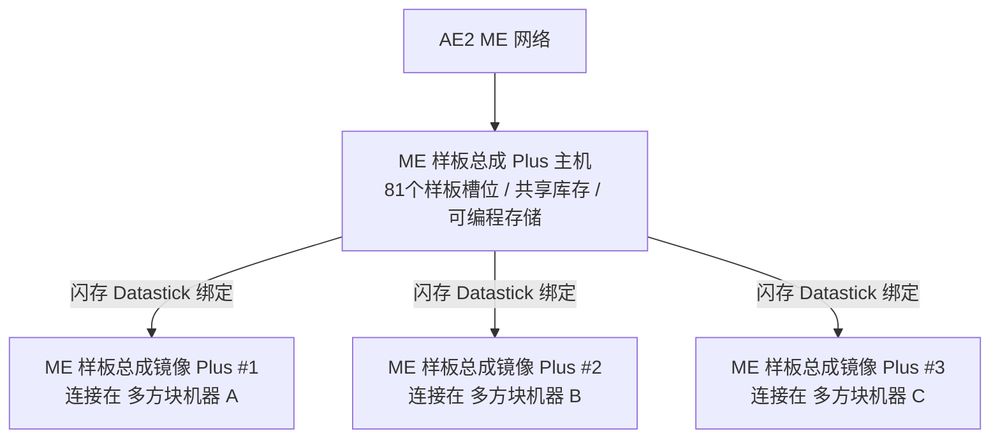

# AE2 深度整合與樣板總成 Plus 系統

GTECore 為應用能源 2 (Applied Energistics 2) 與 GregTech 多方塊結構之間搭建了極其強大的直接資料互聯橋樑。

---

## 🧩 ME 樣板總成 Plus (`me_pattern_buffer_plus`)

在傳統科技模組中，將 AE2 樣板供應器連線到多方塊機器通常面臨**槽位不足、流體與物品無法混合輸出、樣板難以多機共享**的痛點。

GTECore 研發的 **ME 樣板總成 Plus** 徹底解決了這一問題：

### 核心特性
1. **海量樣板容量**：單個總成主機擁有 **81 個樣板槽位**（相當於 9 個標準 AE2 樣板供應器的總和）。
2. **全能倉室能力**：同時具備 `IMPORT_ITEMS`、`IMPORT_FLUIDS`、`EXPORT_ITEMS`、`EXPORT_FLUIDS` 能力，支援流體與物品同倉混合互動。
3. **可程式設計儲存支援**：內部整合 Programmable Storage 機制，支援複雜配方精準投料與快取。

---

## 🪞 ME 樣板總成映象 Plus (`me_pattern_buffer_proxy_plus`)

**樣板總成映象 Plus** 是一種革命性的分散式自動化結構部件：

### 工作原理與跨機器共享
- 將映象總成安裝在任意多方塊機器的倉室位置。
- 手持 **快閃記憶體 (Datastick)** 右鍵主 **ME 樣板總成 Plus** 讀取座標，然後右鍵 **樣板總成映象 Plus** 進行繫結。
- **所有繫結的映象將實時共享主總成內放置的所有 81 個樣板**！
- 當 AE2 網路發起自動化合成任務時，網路會自動負載均衡分配給所有空閒的映象機器並行開工！

### Jade 懸浮狀態顯示
對準樣板總成或映象時，Jade 會自動顯示：
- 主總成：`已連線映象數量: X`
- 映象部件：`已繫結至 - X: ..., Y: ..., Z: ...`

---

## 💨 ME 蒸汽倉 (`me_steam_hatch`)

- **功能**：直接連線 AE2 流體網路與蒸汽多方塊結構。
- **作用**：蒸汽多方塊結構無需外掛複雜的高速蒸汽管道與儲罐，直接以最高吞吐量從 ME 網路中即時抽取蒸汽供能，杜絕管道傳輸瓶頸。
