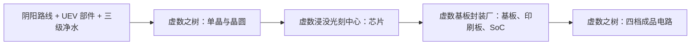

# 超弦與陰陽高階電路及材料系統

GTECore 拓展了橫跨 ZPM 到 MAX 全週期的兩大高階電路分支 —— **超弦電路體系** 與 **陰陽太極電路體系**，並配合以礦石綜合處理中心實現自動化材料大迴圈。

---

## 🌌 超弦電路體系 (Super String Circuitry)

超弦電路從高維震盪弦中獲取超光速算力，主要覆蓋 **ZPM ➜ UEV** 電壓梯度：

### 超弦材料與弦系物質
- **起源之弦 (`item.gtecore.original_string`)**：高維宇宙震盪本源。
- **α弦 / β弦 / γ弦 (`alpha_string`, `beta_string`, `gamma_string`)**：不同能級與偏振態的超弦聚合物。
- **超弦混合機 (`super_string_mixer`)**、**創世之弦 (`string_of_creation`)** 與 **超弦震盪陣列 (`super_string_oscillator_array`)**：用於超弦物質的分裂、調諧與高階固化。

---

## ☯️ 陰陽太極電路體系 (Yin-Yang Circuitry)

陰陽電路體系遵循 **“陰生陽，陽生陰，生生不息”** 的迴圈生克哲學，覆蓋 **UV ➜ UIV** 乃至更高極限：

### 八卦與五行專屬符篆
- **五行元素**：金元素 (`jinyuansu`)、木元素 (`muyuansu`)、水元素 (`shuiyuansu`)、火元素 (`huo`)、土元素 (`tuyuansu`)。
- **五行符篆**：金之符篆、木之符篆、水之符篆、火之符篆、土之符篆。
- **八卦象與晶片**：乾、坤、震、巽、坎、離、艮、兌八大卦象符石與核心晶片。
- **三清之粒 (`god_nugget`)**：凝聚天地玄黃之氣的頂級合成媒介。

---

## 🌳 虛數基礎材料與首棵虛數之樹

虛數基礎材料、控制器、單晶和晶圓配方均在 **UEV 電壓**下製造或執行。先完成陰陽路線、UEV 部件和[三級淨水體系](water-purification-system.md)，再用裝配線、赤陽道核和坤艮星樞製造結構件，最後組裝首棵虛數之樹。

| 結構件 | 製造裝置 | 每批產量 |
| :--- | :--- | ---: |
| 虛數外殼 | 裝配線 | 32 |
| 虛數枝椏外殼 | 裝配線 | 32 |
| 虛數約束外殼 | 裝配線 | 16 |
| 虛數能量導管 | 裝配線 | 16 |
| 虛數核心外殼 | 坤艮星樞 | 4 |
| 虛數玻璃 | 赤陽道核 | 32 |
| 虛數線圈方塊 | 坤艮星樞 | 8 |
| 虛數葉矩陣 | 裝配線 | 64 |

首樹可由既有的**陰陽 UIV 電路**啟動：核心外殼使用陰陽處理器主機，控制器使用 UIV 電路，並需先掃描研究虛數核心外殼。UIV 是所需電路等級，製造配方及研究仍使用 UEV 電壓；無需先造出虛數電路才能造樹。

**虛數葉矩陣是固定結構方塊，虛數生長介質是日常生產耗材。** 生長介質在樹外由赤陽道核製造，每批消耗三級電子級淨化水 4000 mB，產出 32 個。葉矩陣則在裝配線中由虛數玻璃 4、枝椏外殼 4、生長介質 8、巽象、震象各 4，配合電子級淨化水 4000 mB 和 Naquadria 1000 mB，批次產出 64 個，用於搭建樹冠。

成型後，在虛數之樹內持續生產：

- **單晶**：矽粉 64 + 生長介質 4 + 電子級淨化水 4000 mB + Naquadria 1000 mB → 虛數單晶 4 個，UEV、30 秒。
- **普通晶圓**：虛數單晶 1 + 潤滑油 1000 mB + 電子級淨化水 1000 mB → 虛數晶圓 16 片，UEV、15 秒。

單晶生產消耗生長介質，不拆耗樹冠葉矩陣。結構材料、造樹入口和單晶/普通晶圓路線已接通，接下來用專用光刻中心加工晶片。

### 虛數浸沒光刻中心

**虛數浸沒光刻中心**承接虛數之樹產出的普通虛數晶圓，只執行專用的虛數浸沒光刻配方。控制器在裝配線製造：使用既有虛數結構件、UEV 部件、4 個 UIV 電路（可用陰陽處理器主機）和 4 片普通虛數晶圓；先掃描研究普通虛數晶圓。研究和製造均為 **UEV**，無需本機產出的 CPU 晶圓或晶片即可造出第一臺。

以下五道工序均使用 **UEV 電壓**。表中水量為每批直接消耗的**第三級電子級淨化水**；曝光與刻模所需的**陰陽透鏡不消耗，可重複使用**。

| 分支 / 工序 | 每批物品輸入 | 電子級淨化水 | 其他流體 | 每批輸出 | 基礎時間 |
| :--- | :--- | ---: | :--- | :--- | ---: |
| 電路：浸沒曝光 | 普通虛數晶圓 1 + 陰陽透鏡（不消耗） | 2000 mB | 過氧化氫 250 mB | 虛數 CPU 晶圓 1 | 30 秒 |
| 電路：晶圓切割 | 虛數 CPU 晶圓 1 | 1000 mB | 潤滑油 250 mB | 虛數電路晶片 16 | 10 秒 |
| CPU：粗製切割 | 普通虛數晶圓 1 | 1000 mB | 潤滑油 250 mB | 粗製虛數晶片 4 | 15 秒 |
| CPU：精密刻模 | 粗製虛數晶片 1 + 陰陽透鏡（不消耗） | 500 mB | 氫氟酸 100 mB | 刻模虛數晶片 1 | 20 秒 |
| CPU：互連封裝 | 刻模虛數晶片 1 + 銪細導線 4 | 500 mB | 焊錫合金 144 mB | 虛數 CPU 晶片 1 | 20 秒 |

兩條分支分別為**普通晶圓 → CPU 晶圓 → 電路晶片**與**普通晶圓 → 粗製晶片 → 刻模晶片 → CPU 晶片**。把這些晶片送入封裝廠，繼續完成基板、印刷板與 SoC 的生產。

### 虛數基板封裝廠

**虛數基板封裝廠（Imaginary Circuit Fabricator）**是寬 × 高 × 深 **13 × 9 × 13** 的專用多方塊裝置。先掃描研究虛數 CPU 晶片，再在裝配線製造控制器：使用既有虛數結構件、UEV 機械臂/活塞/泵各 4、前代 UIV 電路 4（可用陰陽處理器主機）、虛數 CPU 晶片 4 和虛數電路晶片 8，並消耗焊錫合金 5760 mB、聚苯並咪唑 1152 mB、電子級淨化水 4000 mB。研究與製造均為 **UEV**；控制器不需要本機生產的基板、印刷板或 SoC，啟動鏈不會自鎖。

以下三道專用工序均為 **UEV**，水量為每批直接消耗的第三級電子級淨化水：

| 工序 | 每批物品輸入 | 電子級淨化水 | 其他流體 | 每批輸出 | 基礎時間 |
| :--- | :--- | ---: | :--- | :--- | ---: |
| 基板層壓 | 強化環氧樹脂板 4 + 虛數生長介質 2 + 銪箔 16 | 2000 mB | 聚苯並咪唑 576 mB | 虛數之樹電路基板 4 | 30 秒 |
| 印刷蝕刻 | 虛數之樹電路基板 1 + 銪箔 8 + 金箔 8 | 1000 mB | 氯化鐵 250 mB | 虛數之樹印刷電路基板 1 | 20 秒 |
| SoC 封裝 | 虛數 CPU 晶片 2 + 虛數電路晶片 4 + 虛數之樹印刷電路基板 1 + 銪細導線 8 | 2000 mB | 焊錫合金 288 mB | 虛數之樹 SoC 2 | 30 秒 |

### 返回虛數之樹製造四檔電路

四種成品仍在**虛數之樹**中製造，**配方電壓全部為 UEV**；UHV / UEV / UIV / UXV 是成品電路標籤等級。UHV 處理器使用**三鈦細導線 16**。下表水量不含前置材料的累計耗水：

| 成品電路等級 | 每批產量 | 基礎時間 | 直接電子級淨化水 |
| :--- | ---: | ---: | ---: |
| UHV 虛數處理器 | 4 | 20 秒 | 1000 mB |
| UEV 虛數處理器叢集 | 2 | 30 秒 | 2000 mB |
| UIV 虛數超級計算機 | 1 | 45 秒 | 0 mB |
| UXV 虛數主機 | 1 | 60 秒 | 0 mB |

UIV 與 UXV 透過前置電路間接消耗淨化水。至此，基板、印刷板、SoC 與四檔成品電路的配方鏈已接通。

---

## 💎 礦石綜合處理中心配方模式

**礦石綜合處理中心 (`ore_process_center`)** 預設了 7 大標準化電路模式，可透過在機器內設定程式設計電路編號切換：

| 電路編號 | 工藝路線 | 適用礦物型別與產物特色 | 產出倍率 |
| :---: | :--- | :--- | :---: |
| **電路 1** | 粉碎 ➜ 粉碎 ➜ 洗礦 | 基礎金屬礦石（鐵、銅、錫等）快速量產 | 5 倍主產物 + 副產物 |
| **電路 2** | 粉碎 ➜ 粉碎 ➜ 離心 | 伴生高價值稀有輕金屬礦石 | 5 倍主產物 + 離心精純副產物 |
| **電路 3** | 粉碎 ➜ 洗礦 ➜ 熱離 ➜ 粉碎 | 高溫耐火礦石、貴金屬礦（鉑系、金銀等） | 5~6 倍 + 純淨金屬粉 |
| **電路 4** | 粉碎 ➜ 熱離 ➜ 粉碎 | 硫化物與重度複雜嵌布礦 | 5 倍 + 特殊熱離副產物 |
| **電路 5** | 粉碎 ➜ 洗礦 ➜ 粉碎 ➜ 洗礦 | 稀土礦石與多階段可溶性鹽礦 | 6 倍 + 雙重洗礦副產物 |
| **電路 6** | 粉碎 ➜ 洗礦 ➜ 粉碎 ➜ 離心 | 放射性重礦（鈾、釷、鈽系）與稀土 | 6 倍 + 精細離心重金屬 |
| **電路 8** | 粉碎 ➜ 洗礦 ➜ 粉碎 ➜ 電磁選礦 | 強磁性與順磁性礦物（磁鐵礦、鉻、鈦等） | 6~8 倍 + 電磁純淨粉 |
