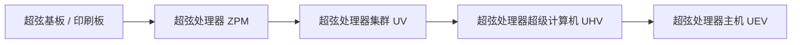
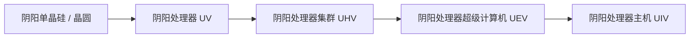

# 超弦與陰陽高階電路及材料系統

GTECore 拓展了橫跨 ZPM 到 MAX 全週期的兩大高階電路分支 —— **超弦電路體系** 與 **陰陽太極電路體系**，並配合以礦石綜合處理中心實現自動化材料大迴圈。

---

## 🌌 超弦電路體系 (Super String Circuitry)

超弦電路從高維震盪弦中獲取超光速算力，主要覆蓋 **ZPM ➜ UEV** 電壓梯度：

### 超弦材料與弦系物質
- **起源之弦 (`item.gtecore.original_string`)**：高維宇宙震盪本源。
- **α弦 / β弦 / γ弦 (`alpha_string`, `beta_string`, `gamma_string`)**：不同能級與偏振態的超弦聚合物。
- **超弦混合機 (`super_string_mixer`)**、**創世之弦 (`string_of_creation`)** 與 **超弦震盪陣列 (`super_string_oscillator_array`)**：用於超弦物質的分裂、調諧與高階固化。

---

## ☯️ 陰陽太極電路體系 (Yin-Yang Circuitry)

陰陽電路體系遵循 **“陰生陽，陽生陰，生生不息”** 的迴圈生克哲學，覆蓋 **UV ➜ UIV** 乃至更高極限：

### 八卦與五行專屬符篆
- **五行元素**：金元素 (`jinyuansu`)、木元素 (`muyuansu`)、水元素 (`shuiyuansu`)、火元素 (`huo`)、土元素 (`tuyuansu`)。
- **五行符篆**：金之符篆、木之符篆、水之符篆、火之符篆、土之符篆。
- **八卦象與晶片**：乾、坤、震、巽、坎、離、艮、兌八大卦象符石與核心晶片。
- **三清之粒 (`god_nugget`)**：凝聚天地玄黃之氣的頂級合成媒介。

---

## 💎 礦石綜合處理中心配方模式

**礦石綜合處理中心 (`ore_process_center`)** 預設了 7 大標準化電路模式，可透過在機器內設定程式設計電路編號切換：

| 電路編號 | 工藝路線 | 適用礦物型別與產物特色 | 產出倍率 |
| :---: | :--- | :--- | :---: |
| **電路 1** | 粉碎 ➜ 粉碎 ➜ 洗礦 | 基礎金屬礦石（鐵、銅、錫等）快速量產 | 5 倍主產物 + 副產物 |
| **電路 2** | 粉碎 ➜ 粉碎 ➜ 離心 | 伴生高價值稀有輕金屬礦石 | 5 倍主產物 + 離心精純副產物 |
| **電路 3** | 粉碎 ➜ 洗礦 ➜ 熱離 ➜ 粉碎 | 高溫耐火礦石、貴金屬礦（鉑系、金銀等） | 5~6 倍 + 純淨金屬粉 |
| **電路 4** | 粉碎 ➜ 熱離 ➜ 粉碎 | 硫化物與重度複雜嵌布礦 | 5 倍 + 特殊熱離副產物 |
| **電路 5** | 粉碎 ➜ 洗礦 ➜ 粉碎 ➜ 洗礦 | 稀土礦石與多階段可溶性鹽礦 | 6 倍 + 雙重洗礦副產物 |
| **電路 6** | 粉碎 ➜ 洗礦 ➜ 粉碎 ➜ 離心 | 放射性重礦（鈾、釷、鈽系）與稀土 | 6 倍 + 精細離心重金屬 |
| **電路 8** | 粉碎 ➜ 洗礦 ➜ 粉碎 ➜ 電磁選礦 | 強磁性與順磁性礦物（磁鐵礦、鉻、鈦等） | 6~8 倍 + 電磁純淨粉 |
