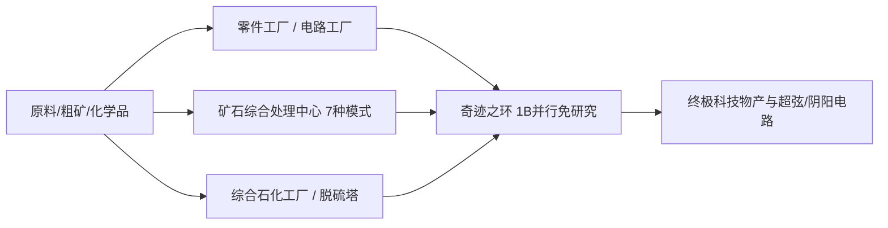

# GTECore 多方塊機器圖鑑

GTECore 針對科技線中後期繁瑣的流水線堆疊，設計了大量兼具**超高並行能力**與**聚合生產邏輯**的多方塊機器。

---

## 🏭 蒸汽時代大型多方塊

為解決蒸汽時代單機產能低下、佔地冗餘的問題，GTECore 引入了一系列大型蒸汽多方塊，全部支援跨配方並行與大容量蒸汽吞吐：

| 機器名稱 (Block ID) | 核心功能與配方型別 | 特性與優勢 |
| :--- | :--- | :--- |
| **大型蒸汽合金爐** (`gtceu:big_alloy`) | 合金冶煉 (`alloy_smelter`) | 早期高倍率合金生產，支援高壓蒸汽 |
| **大型蒸汽壓縮機** (`gtceu:big_compressor`) | 壓縮處理 (`compressor`) | 批次壓制緻密金屬板與塊 |
| **大型蒸汽鍛造錘** (`gtceu:big_forge_hammer`) | 鍛造錘打粉/板 (`forge_hammer`) | 自動化板材與粗礦快速破碎 |
| **大型蒸汽提取機** (`gtceu:big_steam_extractor`) | 橡膠/流體提取 (`extractor`) | 大規模提取樹膠與工業流體 |
| **簡易蒸汽磨粉機** (`gtceu:steam_grinder_easy`) | 礦石磨粉 (`macerator`) | 早期礦物多倍處理 |
| **簡易蒸汽熔煉爐** (`gtceu:steam_oven_easy`) | 熱解熔鍊 (`pyrochlore_oven`) | 焦炭與木炭工業化大批次燒製 |
| **蒸汽礦物處理廠** (`gtecore:steam_op`) | 綜合礦石粉碎與精煉 | **10 億 (1B) 並行**，所有配方 **1 tick** 執行完畢！支援任意輸入輸出倉室 |

---

## ⚡ 超級電氣工業多方塊

進入電力時代後，GTECore 提供了多合一與高階加工中心：

### 1. 核心生產工廠

- **§6零件工廠 (`gtceu:component_factory`)**：
  - **定位**：一步到位生產馬達、泵、活塞、機械臂、傳送帶、發光二極體等各類常用基礎元件。
  - **特性**：直接跳過繁瑣的中間子工序，極速產出指定電壓等級的標準工業配件。
- **§6電路工廠 (`gtceu:circuit_factory`)**：
  - **定位**：積體電路基板、晶片蝕刻、整合封裝於一體。
  - **特性**：支援跨配方並行倉，全面加速 ULV 到 MAX 全電壓梯度的電路板生產。
- **§6奇蹟之環 (`gtceu:miracle_ring`)**：
  - **定位**：工業奇蹟終極裝配設施。
  - **特性**：擁有 **10 億 (1B) 並行** 與 **1t Subtick 超頻**，**無需進行任何科研/裝配線研究**即可直接執行裝配線配方！
- **化學終結者 (`gtecore:chemistry_terminator`)**：
  - **定位**：“顛覆了化學與物理的存在，代表著化學的終結”。
  - **特性**：將繁複的十幾步長鏈化學反應一鍵聚合，極速合成各種終極聚合物與酸類介質。
- **十合一通用處理工廠 (`gtecore:ten_in_one`)**：
  - **定位**：融合離心、電解、化學浸礦、聚合、高壓反應等 10 大基礎工序的萬能整合箱。

### 2. 礦石與流體精煉體系

- **§6礦石綜合處理中心 (`gtecore:ore_process_center`)**：
  - 支援 **7 種程式設計電路模式**，實現不同產物導向的礦物 5~8 倍精煉（粉碎、洗礦、熱離、離心、電磁選礦全整合），支援 1t Subtick 超頻。
- **綜合石化工廠 (`gtecore:integrated_petrochemical_plant`)**：
  - 整合原油分餾、催化裂化、重整、脫硫全鏈條，單機產出全部烴類輕質氣與芳香烴。
- **脫硫機 (`gtceu:desulfurization`)**：
  - 快速淨化各類重質含硫燃油，回收高純度硫粉副產物。
- **簡易/進階流體鑽機 (`gtecore:easy_fluid_drilling_rig` / `not_hard_fluid_drilling_rig`)**：
  - 自動抽汲基岩流體礦脈，永不枯竭，無需複雜管道勘探。

### 3. 高階與超導線纜加工

- **§6導線工廠 (`gtecore:wiremill_factory`)**：一鍵生產所有金屬單股、雙股、四股、八股、十六股導線及超導線纜。
- **§6晶核中樞 (`gtecore:crystal_center`)**：規模化自動培育單晶矽柱、綠寶石、藍寶石、充能賽克斯泰爾晶體。
- **§6量子線擎 (`gtecore:quantum_cable_assembler`)**：專門用於高速製造量子光纖與超維能量傳輸線纜。
- **§3星刃蝕刻儀 (`gtecore:starblade_etching_machine`)**：利用高能光束在極紫外/X射線波段刻蝕星系級微納晶片。

---

## 🔋 能源與發電機系統

| 機器名稱 | 能源輸出/等級 | 核心機制與特性 |
| :--- | :--- | :--- |
| **§6通用燃料引擎** (`gtceu:general_fuel_engine`) | 動態自適應 (最高 MAX) | **支援世界上所有型別的燃料**（柴油、生物質、天然氣、火箭燃油等），擁有 **20 億 (2B) 並行**，瞬息之間釋放天量能量！ |
| **大型通用發電機** (`gtecore:large_general_generator`) | 多級電壓可選 | 適配常規燃氣、蒸汽與等離子發電機轉子 |
| **超級聚變反應堆** (`gtecore:super_fusion_reactor`) | 聚變等離子體輸出 | 徹底消除普通聚變漫長的升溫等待，**完美支援 1T Subtick 超頻**，瞬時輸出高溫聚變產物 |
| **上限壓超級電池箱** (`gtecore:max_super_battery_buffer_1x`) | **MAX (2,147,483,647 V)** | 容納超海量 EU 快取，支援零損耗跨維無線充能介面 |
