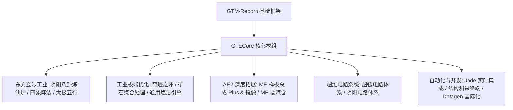

# GTECore 核心模組概覽

**GTECore** 是 GregTech Easy 專案的定製化 Java 核心模組。它直接依賴 `gtm-reborn` 原始碼，拓展了大規模多方塊工業結構、高階陣法科技、AE2 深層互動以及超級電路製造體系。

---

## 🏛️ 模組架構與設計定位

---

## 📦 創造模式物品欄與分類

GTECore 在遊戲內註冊了獨立的創造模式標籤頁：

1. **格雷科技Easy機器 (`itemGroup.gtecore.gtecore_machines`)**：
   - 包含所有 GTE 原創多方塊主方塊（陰陽八卦高爐、奇蹟之環、礦石處理中心、化學終結者等）。
   - 包含多級超級電池箱（Max Super Battery Buffer）、ME 蒸汽倉、ME 樣板總成 Plus 及映象。
2. **格雷科技Easy物品 (`itemGroup.gtecore.gtecore_items`)**：
   - 包含超弦與陰陽電路系列物品（處理器、叢集、超算、主機）。
   - 包含五行元素符篆、八卦晶片、三清之粒、結構測試終端等專用道具。

---

## ⚙️ 模組全域性配置 (`GTEConfig`)

GTECore 提供了豐富的遊戲內與檔案配置項（位於 `config/gtecore-common.toml` 或遊戲內配置選單）：

| 配置項 | 預設值 | 詳細說明 |
| :--- | :--- | :--- |
| `superPeace` (超級和平模式) | `false` | 開啟後全面禁用惡性敵對生物生成，為科技建造提供絕對純淨環境 |
| `durationMultiplier` (配方時間倍率) | `1.0` | 全域性調整 GTECore 自定義配方的耗時倍率 |

---

## 🔍 Jade / TOP 原生整合

GTECore 內建了 **`GTEJadePlugin`** 外掛支援：
- **ME 樣板總成 Plus 狀態**：實時顯示當前總成繫結的樣板數、流體與物品輸出模式。
- **ME 樣板總成映象 Plus 繫結資訊**：懸浮直接顯示繫結的主總成座標 `(X, Y, Z)` 以及網路連通狀態。
- **陣法啟用指示**：在陰陽八卦煉仙爐上實時顯示青龍、白虎、朱雀、玄武四象陣法的就緒狀態。

---

## 🛠️ 結構檢測終端 (`Structure Testing Terminal`)

GTECore 提供了專屬的手持工具 —— **結構檢測終端** (`item.gtecore.check_structure_terminal`)：
- **右鍵多方塊控制器**：實時掃描結構完整性。
- **錯誤診斷提示**：若結構未成型，終端會在聊天欄和懸浮提示中精準指出**錯誤方塊座標及不應放置的位置**，極大加速大型多方塊建造與排錯。
