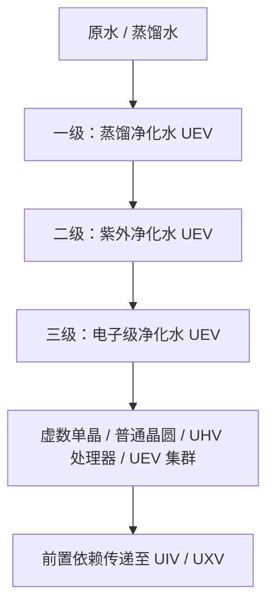

# 三級水質淨化系統與工業水迴圈規範

GTECore 的 **三級水質淨化體系整體屬於 UEV 階段**，為虛數系列關鍵產物提供第三級電子級淨化水。一、二、三級表示處理工序和水質等級，並不是三個不同的電壓時代。中樞、三級裝置及控制倉均使用 UEV 部件、電路和製造電壓，三階段淨化與 EDI 再生配方也統一使用 UEV 執行電壓。

整套產線由 **一臺中樞淨化水廠 + 三臺分階淨化裝置** 組成，採用 GTNH / GTO 同款的「中樞統管」設計：各級淨化裝置自身沒有能源倉，必須用資料棒連線到中樞，由中樞統一供電並下發並行度。

---

## 💧 三級淨化水流體體系

| 註冊流體 | 材質命名 (Lang) | 顏色質感 | 現實工業對標 | 關鍵水質指標 | 准入科技階梯 |
| :--- | :--- | :--- | :--- | :--- | :---: |
| `distilled_purified_water` | **§3蒸餾淨化水** | `0x4A94FF` (湖水藍) | 工業高純多效熱精餾水 | 電阻率 $> 1\ \text{M}\Omega\cdot\text{cm}$ $\text{TOC} < 50\ \text{ppb}$ | **UEV 階** |
| `uv_purified_water` | **§9紫外淨化水** | `0x7B68EE` (紫外羅蘭藍) | 深紫外高能光催化超淨水 | 電阻率 $> 10\ \text{M}\Omega\cdot\text{cm}$ $\text{TOC} < 1\ \text{ppb}$ | **UEV 階** |
| `ultrapure_water` | **§b電子級淨化水** | `0x80D8FF` (極純天藍) | SEMI E-1.1 級電子級超純水 (UPW) | 電阻率 $= 18.2\ \text{M}\Omega\cdot\text{cm}$ $\text{TOC} < 0.05\ \text{ppb}$ | **UEV 階** |

水質指標是工藝背景說明；遊戲中的實際行為由配方、溫控、紫外劑量和 EDI 負載機制決定。

---

## 🏭 四臺多方塊裝置

| 機器 | 註冊 ID | 科技階段 |
| :--- | :--- | :---: |
| **中樞淨化水廠** | `central_water_purification_plant` | UEV |
| **一級澄清淨化裝置** | `t1_clarifier_purification_unit` | UEV |
| **二級紫外氧化淨化裝置** | `t2_uv_oxidation_purification_unit` | UEV |
| **三級 EDI 超純淨化裝置** | `t3_edi_ultrapure_purification_unit` | UEV |

> 舊的 `ultrapure_water_refinery`（超純水綜合精煉中心）僅保留相容註冊，已停用，不能繼續執行完整淨化鏈條；請遷移到中樞與三級裝置。

### 1. 中樞淨化水廠（Central Water Purification Plant）

整條產線的控制與供電核心，自身不執行淨化配方，只做三件事：

1. **連線**：用資料棒把各級淨化裝置繫結到中樞（詳見下方操作方式），繫結關係持久化儲存；
2. **供電**：把中樞能源倉中的電力實時轉發給所有已連線且已成型的淨化裝置，並在 GUI 中顯示實際輸出功率（EU/s）；
3. **下發並行**：GUI 中設定的並行度會廣播給全部已連線裝置，作為它們的並行上限。

未連線中樞（或中樞未成型）的淨化裝置無法開機，GUI 會給出紅色提示。

### 2. 一級澄清淨化裝置（UEV 階）

- **反應原理**：利用差壓閃蒸技術降低水的沸點，瞬間蒸發純水蒸汽並與重金屬離子和無機鹽分離，透過氣液分離捕滴板冷凝收集純相，並脫除遊離氧與二氧化碳氣體。
- **工藝流**：
  - 普通水 1000 mB + 複合絮凝劑 50 mB + 改性碳微球 1 個 → 蒸餾淨化水 900 mB / 60 t，機率副產鹽粉與稀土粉
  - 蒸餾水 1000 mB + 複合絮凝劑 25 mB + 改性碳微球 1 個 → 蒸餾淨化水 1000 mB / 30 t，機率副產鹽粉
- **效能特點**：作為 UEV 淨化鏈條的入口；實際水產量還受溫控穩定度影響，以上為配方標稱值。

### 3. 二級紫外氧化淨化裝置（UEV 階）

- **反應原理**：採用深紫外（DUV）光源輻射流體，斷開水中長鏈微量有機化合物化學鍵；輔以強氧化劑在紫外光催化下激發出高氧化電位自由基，快速將總有機碳（TOC）和膠體微生物礦化分解。
- **工藝流**：
  - 蒸餾淨化水 800 mB + 臭氧 50 mB → 紫外淨化水 800 mB + 氧氣 25 mB / 40 t
  - 蒸餾淨化水 800 mB + 過氧化氫 50 mB → 紫外淨化水 800 mB + 氧氣 25 mB / 20 t（快速 AOP 路線）；兩條路線還必須滿足紫外劑量要求
- **效能特點**：水中有機碳含量暴降至 1 ppb 以下，達到微納晶片光刻與生物潔淨室級標準。

### 4. 三級 EDI 超純淨化裝置（UEV 階）

- **反應原理**：在強直流電場作用下，透過交替排列的離子交換選擇性透過膜，強行將水中殘留的矽酸根、硼酸根等弱電解質陰陽離子全部定向驅離；遊戲中需要電子級酸鹼試劑與混床樹脂珠，並透過獨立再生配方清除積累的離子負載。
- **工藝流**：
  - 紫外淨化水 800 mB + 電子級酸鹼試劑 20 mB + 混床樹脂珠 1 個 → 電子級淨化水 800 mB / 30 t
  - EDI 再生：紫外淨化水 100 mB + 電子級酸鹼試劑 1 mB / 2 t，僅清除離子負載，不產水
- **效能特點**：水電阻率達到理論絕緣極值 $18.2\ \text{M}\Omega\cdot\text{cm}$，是超晶格晶片加工、虛數工程不可替代的終極流體。

---

## 🔌 資料棒連線與執行方式

1. **複製中樞座標**：潛行 + 右鍵中樞淨化水廠（手持 GT 資料棒），聊天欄提示「已複製中樞淨化水廠座標」；
2. **繫結淨化裝置**：手持該資料棒右鍵任意一臺分階淨化裝置，提示「已連線中樞淨化水廠」；
   - 反向操作同樣有效：潛行 + 右鍵淨化裝置複製其座標，再右鍵中樞即可連線。
3. **接入電力**：給中樞安裝能源倉（1–4 個，支援鐳射倉），中樞會把電力轉發給所有已連線裝置；
4. **設定並行**：開啟中樞 GUI，在底部「並行度」輸入框設定並行上限（1 ~ 65536），所有已連線裝置立即生效；
5. **檢視狀態**：淨化裝置 GUI 會顯示所連中樞座標、中樞下發的並行度與自身內部電力緩衝。

### 供電與並行的關係

- 每臺淨化裝置的耗電 = 配方耗電 × 實際並行度，電力全部由中樞提供；
- 三臺裝置的電力上限均為 `UEV 電壓 × 256 A`；一、二、三級表示處理工序，不代表不同的執行電壓或解鎖階段；
- 實際並行度還受 **輸入倉中的原料量** 與 **輸出倉剩餘容量** 限制，因此需要按目標吞吐配置足夠大的輸入/輸出倉；
- 中樞 GUI 中把並行度調得再高，超出電力與倉容的部分也不會生效——這與 GTNH 淨水廠「並行不足多為電力不足」的現象一致。

---

## 🔄 虛數系列下游與啟動順序

第三級電子級淨化水（`ultrapure_water`）用於以下虛數之樹配方；數量均為每批配方的直接消耗：

| 產物 | 每批產量 | 電子級淨化水 |
| :--- | ---: | ---: |
| 虛數單晶 | 4 個 | 4000 mB |
| 普通虛數晶圓 | 16 片 | 1000 mB |
| UHV 虛數處理器 | 4 個 | 1000 mB |
| UEV 虛數處理器叢集 | 2 個 | 2000 mB |

UIV 虛數超級計算機與 UXV 虛數主機不額外直接耗水，但透過 UEV 叢集等前置產物繼承淨水依賴。產物的電路等級與其配方電壓不改變淨水體系整體 UEV 的定位。

啟動順序是 **UHV 部件 + 陰陽路線 → UEV 八部件 → UEV 淨水裝置 → 三級電子級淨化水 → 虛數關鍵產物**。UEV 八部件由整合包新增的 UEV 部件配方提供；陰陽配方和這些部件配方不直接消耗電子級淨化水，避免淨水裝置依賴自己的產物才能製造。

虛數結構材料、首樹製造和單晶/普通晶圓路線已接通，詳見[虛數基礎材料與首棵虛數之樹](circuits-and-materials.md)。生長介質在赤陽道核中每批消耗電子級淨化水 4000 mB，產出 32 個；葉矩陣是固定結構，樹內單晶生產持續消耗生長介質。

**虛數浸沒光刻中心**繼續消耗第三級電子級淨化水，以專用配方加工普通虛數晶圓。CPU 晶圓、粗製晶片、刻模晶片、電路晶片和 CPU 晶片五道工序均已接通，全部執行於 UEV；每批直接耗水分別為 **2000、1000、500、1000、500 mB**。曝光和刻模使用可重複使用、不消耗的陰陽透鏡。兩條分支及完整物料用量見[虛數浸沒光刻中心](circuits-and-materials.md)。控制器以陰陽 UIV 電路和普通虛數晶圓啟動，不依賴本機晶片產物。

### 虛數基板封裝廠

[虛數基板封裝廠](circuits-and-materials.md)以光刻中心產出的 CPU 晶片、電路晶片，以及前代 UIV 電路和 UEV 部件啟動，不依賴自身產出的基板或 SoC。三道工序均使用 UEV：

| 工序產物 | 每批產量 | 直接電子級淨化水 | 基礎時間 |
| :--- | ---: | ---: | ---: |
| 虛數之樹電路基板 | 4 | 2000 mB | 30 秒 |
| 虛數之樹印刷電路基板 | 1 | 1000 mB | 20 秒 |
| 虛數之樹 SoC | 2 | 2000 mB | 30 秒 |

基板、印刷板、SoC 與四檔成品電路的配方鏈已接通。四檔成品仍由虛數之樹以 **UEV 製造電壓**產出，每批分別為 **4 / 2 / 1 / 1**；其 **UHV / UEV / UIV / UXV 電路標籤**保持不變。UIV 與 UXV 透過前置產物間接耗水。

星刃蝕刻儀、電路工廠的降級水回收、礦石處理額外收益等下游方案尚未實現，不能作為當前可用功能；也沒有已實現的 90% 回收閉環。
