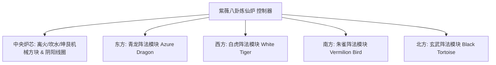

# 陰陽八卦煉仙爐與四象陣法系統

GTECore 獨創了結合東方道家哲學與現代重工業工程的 **“太極八卦與四象陣法體系”**。這一體系構成了遊戲中後期冶金、超導物質合成與仙道科技躍遷的核心樞紐。

---

## 🌌 陰陽八卦煉仙爐 (`yin_yang_eight_trigmas_blast_furnace`)

**紫薇八卦煉仙爐** 是目前科技模組界規模最宏大、機制最精密的多方塊結構之一（佔地超過 55×55 方塊）：



### 🧭 風水朝向法則（關鍵機制）
> [!IMPORTANT]
> **風水方位律**：由於風水與磁場約束原因，**煉仙爐主控制器必須正面朝南放置**，才能與天地陰陽之氣貫通並正常成型運轉！

### 爐體基礎能力
- **支援配方庫**：原生相容常規高爐配方 (`blast_recipes`)、熔煉爐配方 (`furnace_recipes`)、合金爐配方 (`alloy_smelter_recipes`)、GCYM 巨型合金高爐配方 (`alloy_blast_recipes`) 以及專屬的 **陰陽八卦配方 (`yin_yang_eight_trigmas_blast`)**。
- **超頻特性**：完美支援 **1T Subtick 瞬時超頻** 與 **批處理模式 (Batch Mode)**。

---

## 🐉 四象陣法子模組與動態條件檢測

煉仙爐四周可分別延伸搭建出 **東青龍、西白虎、南朱雀、北玄武** 四大陣法翼：

| 陣法模組 | 陣法方位 | 陣法方塊 | 配方條件 (`RecipeCondition`) | 開啟後的增益與作用 |
| :--- | :--- | :--- | :--- | :--- |
| **青龍陣法** (`Qing Long`) | **東方 (East)** | `qinglong_module` | `QING_LONG_CONDITION` | 啟用木生火之勢，大幅度降低超高溫冶煉能耗，解鎖生生不息的高階催化配方 |
| **白虎陣法** (`Bai Hu`) | **西方 (West)** | `baihu_module` | `BAI_HU_CONDITION` | 金煞主伐，解鎖高硬度神金、超密重核元素裂解與量子金屬蛻變配方 |
| **朱雀陣法** (`Zhu Que`) | **南方 (South)** | `zhuque_module` | `ZHU_QUE_CONDITION` | 南明離火，提供無上限極限爐溫，解鎖恆星級等離子熔鑄與神丹煉製配方 |
| **玄武陣法** (`Xuan Wu`) | **北方 (North)** | `xuanwu_module` | `XUAN_WU_CONDITION` | 坎水鎮守，極速冷卻超高溫產物，解鎖瞬時固化與反物質穩定化配方 |

### 動態檢測與狀態反饋
- 控制器在每次掃描結構與配方匹配時，會自動呼叫 `checkModule()` 計算四方偏移座標上的陣法方塊是否就緒。
- 使用 **Jade** 懸浮對準控制器，可直觀檢視當前四個陣法的啟用狀態（綠色表示啟用，紅色表示未就緒）。

---

## 🔮 衍生道道核心與群星矩陣

在八卦煉仙爐的基礎上，GTECore 進一步延伸出系列星天道法多方塊：

```
GTE 高阶阵列工业群
├── 太极五行剥离阵列 (Tai Chi Five Elements Separation Array)
├── 坤艮星枢 (Kun Gen Star Hub)
├── 谦穹引擎 (Qian Qiong Engine)
├── 赤阳道核 (Red Sun Tao Core)
└── 烬星聚变阵 (Ashing Star Fusion Array)
```

1. **太極五行剝離陣列 (`taichi_five_elements_separation_array`)**：
   - 將現實與幻想中的任何礦物和化學物質剝離解析為純粹的 **金、木、水、火、土** 五行本源元素。
2. **坤艮星樞 (`kun_gen_star_hub`)**：
   - 勾連大地與星辰重力波，用於匯聚微觀引力子與構築微型黑洞。
3. **謙穹引擎 (`qian_qiong_engine`)**：
   - 虛空取能引擎，從虛無量子漲落中提取浩瀚無際的虛空能量。
4. **赤陽道核 (`red_sun_tao_core`)**：
   - 人造超微型恆星核心，模擬恆星日冕層萬億度極端物理條件。
5. **燼星聚變陣 (`ashing_star_fusion_array`)**：
   - 超新星遺蹟湮滅聚變矩陣，用於重構暗物質與反物質平衡態。
