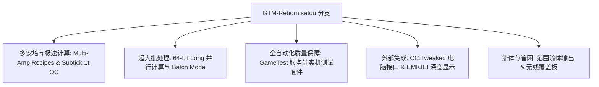

# GregTech Modern Reborn (GTM Reborn)

`modules/gtm-reborn` 是 GTE-Multi 深度定製的 GregTech Modern 獨立分支（分支名為 `satou`）。

---

## 🚀 `satou` 分支核心增強特性

相比上游原版，GTM-Reborn 在現代高版本 Minecraft 1.20.1 上實現了多項革命性技術演進與工業體驗升級：



### 1. 64 位長整型並行與批處理模式 (Batch Mode)
- **突破 32 位整型上限**：平行計算全面採用 `long` 資料型別，徹底解決超大型工業群在極高並行下數值溢位或計算截斷問題。
- **智慧批處理模式**：當原料極其充沛時，機器可將成百上千次微小配方打包為單個週期執行，極大降低伺服器 Tick 負載。

### 2. 1T Subtick 瞬時超頻 (OC_PERFECT_SUBTICK)
- 最佳化了機器 Recipe Logic 執行流水線，允許指定高階機器在 1 個 Tick 內完成多次配方迭代，釋放純粹的工業生產極限。

### 3. 多安培輸入與配方支援 (Multi-Amp)
- 機器配方支援單配方消耗/輸出多安培（Amperes）電流，支援 EMI/JEI 介面直觀渲染多安培數值與導線規格提示。

### 4. 範圍流體輸出 (Ranged Fluid Outputs)
- 允許高階蒸餾塔與化學反應器根據不同溫度與壓力工況輸出帶有範圍浮動的流體產物。

### 5. CC:Tweaked (ComputerCraft) 現代外設整合
- 所有標準機器均向 ComputerCraft 開放外設介面：
  - 實時查詢配方進度、剩餘時間、當前 EU/t 消耗。
  - 透過 Lua 指令碼動態開啟、暫停機器或切換工作模式。

---

## 🧪 自動化測試與 GameTest 驗證

GTM-Reborn 包含完整的 Minecraft 原生 GameTest 自動化測試套件（位於 `src/test`）：

```powershell
# 运行 GameTest 自动化服务端测试
$env:JAVA_HOME='C:\Users\Ex_Je\.jdks\ms-21.0.11'
.\gradlew.bat :modules:gtm-reborn:runGameTestServer
```

### 測試覆蓋範圍
- **Cover 系統**：測試流體泵板、物品傳送板、能量導流板的吞吐與防漏邏輯。
- **機器 Recipe Logic**：測試多安培、批處理、跨配方並行與超頻計算。
- **多方塊成型與旋轉**：測試各類機殼、倉室在不同朝向下的結構驗證。

---

## 🌿 子模組 Git 工作流規範

`modules/gtm-reborn` 對應獨立 Git 倉庫 `takanashisatou/GregTech-Modern-Reborn`，預設開發分支為 `satou`：

```bash
# 独立在子模块中开发与提交
cd modules/gtm-reborn
git checkout satou
git add .
git commit -m "feat: optimize multiblock recipe logic"
git push origin satou

# 回到主工程更新 submodule 指针
cd ../..
git add modules/gtm-reborn
git commit -m "chore: bump gtm-reborn submodule pointer"
```
