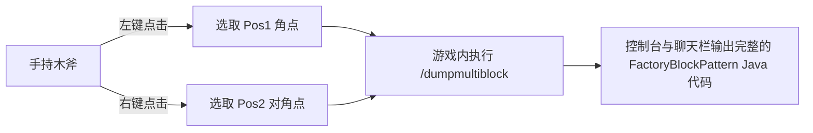

# KubeJS 工具集與多方塊匯出器 (`/dumpmultiblock`)

GTE 在 KubeJS 服務端指令碼中內建了開發者專用的多方塊自動化構建與結構提取工具，徹底解放多方塊結構設計流程。

---

## 🪓 多方塊視覺化匯出器 (`/dumpmultiblock`)

在開發自定義多方塊（無論是 Java 程式碼還是 KubeJS 指令碼）時，手動編寫由數十層字元組成的 `FactoryBlockPattern.aisle(...)` 極其耗時且極易出錯。

GTE 內建了 **`/dumpmultiblock` 木斧框選匯出器** (`server_scripts/easymultiblock.js`)：



### 使用步驟

1. 進入遊戲創造模式，手持一把 **木斧 (`minecraft:wooden_axe`)**。
2. 按照構想在世界中直接搭建好完整的多方塊物理結構（包括機殼、倉室、線圈、主控制器）。
3. 使用木斧 **左鍵點選** 結構的一個底角方塊（聊天欄提示 `已設定 Pos1: x, y, z`）。
4. 使用木斧 **右鍵點選** 結構的對角線頂角方塊（聊天欄提示 `已設定 Pos2: x, y, z`）。
5. 在聊天框輸入指令：
   ```mcfunction
   /dumpmultiblock
   ```
6. 指令碼會自動掃描三維包圍盒內的所有方塊型別，分配字元對映（`.` 為空氣，`A-Z/a-z/0-9` 為具體方塊），並在後臺日誌與客戶端直接生成結構程式碼：

```java
// 自动导出的 FactoryBlockPattern 模板
.pattern(definition -> FactoryBlockPattern.start()
    .aisle("BBB", "BBB", "BBB")
    .aisle("BBB", "BAB", "BBB")
    .aisle("BBB", "B#B", "BBB")
    .where('A', Predicates.blocks("minecraft:air"))
    .where('#', Predicates.controller(Predicates.blocks(definition.getBlock())))
    .where('B', Predicates.blocks("gtceu:steam_machine_casing").or(Predicates.autoAbilities(definition.getRecipeTypes())))
    .build()
)
```

---

## 🌌 維度氣體與流體礦脈配置

GTE 透過 KubeJS 對全維度流體與氣體收集進行了擴充套件：

### 1. 全維度氣體抽取 (`dimension_gas.js`)
使用大型集氣室 (`gas_collector`) 配合不同電路編號，可在任意維度抽取該維度專屬大氣：
- **主世界空氣**：`circuit(4)` ➜ 輸出 `gtceu:air 10000`
- **下界地獄之氣**：`circuit(5)` ➜ 輸出 `gtceu:nether_air 10000`
- **末地虛空之氣**：`circuit(6)` ➜ 輸出 `gtceu:ender_air 10000`

### 2. 萬能電路轉換器 (`universal_circuit.js`)
為解決跨模組與各等級電路板繁雜的配方堆疊，GTE 引入了 **通用電路 (`universal_circuit`)** 系統：
- 允許在打包機 (`packer`) 中將任意同電壓等級的電路（ULV 至 MAX）以 **1 EU / 1 tick** 無損轉換為統一的通用電路物品。
