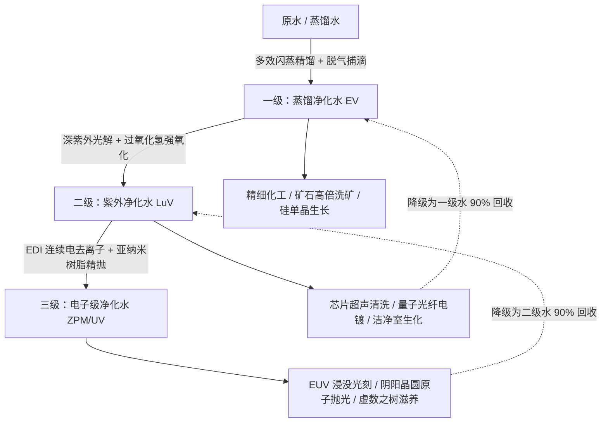

# 三级水质净化系统与工业水循环规范

在现代微电子制造、半导体晶圆制造以及终极高阶超弦/阴阳电路的生产中，高纯净度与极低杂质的水流体是维持高良品率的核心支柱。GTECore 引入了一套完整的 **三级水质净化与闭环工业水循环体系**，覆盖从中阶电气工业（EV）至终极超维工业（UV/UHV+）的全生命周期。

整套产线由 **一台中枢净化水厂 + 三台分阶净化装置** 组成，采用 GTNH / GTO 同款的「中枢统管」设计：各级净化装置自身没有能源仓，必须用数据棒连接到中枢，由中枢统一供电并下发并行度。

---

## 💧 三级净化水流体体系

| 注册流体 | 材质命名 (Lang) | 颜色质感 | 现实工业对标 | 关键水质指标 | 准入科技阶梯 |
| :--- | :--- | :--- | :--- | :--- | :---: |
| `distilled_purified_water` | **§3蒸馏净化水** | `0x4A94FF` (湖水蓝) | 工业高纯多效热精馏水 | 电阻率 $> 1\ \text{M}\Omega\cdot\text{cm}$ $\text{TOC} < 50\ \text{ppb}$ | **EV 阶** |
| `uv_purified_water` | **§9紫外净化水** | `0x7B68EE` (紫外罗兰蓝) | 深紫外高能光催化超净水 | 电阻率 $> 10\ \text{M}\Omega\cdot\text{cm}$ $\text{TOC} < 1\ \text{ppb}$ | **LuV 阶** |
| `ultrapure_water` | **§b电子级净化水** | `0x80D8FF` (极纯天蓝) | SEMI E-1.1 级电子级超纯水 (UPW) | 电阻率 $= 18.2\ \text{M}\Omega\cdot\text{cm}$ $\text{TOC} < 0.05\ \text{ppb}$ | **ZPM / UV 阶** |

---

## 🏭 四台多方块设备

| 机器 | 注册 ID | 阶数 | 体量 (X×Y×Z) | 结构基调 |
| :--- | :--- | :---: | :---: | :--- |
| **中枢净化水厂** | `central_water_purification_plant` | IV 枢纽 | 7 × 9 × 7 | 水密外壳八角塔 + 洁净室玻璃水幕 + 中轴虚数光核 + 集水主管 |
| **一级澄清净化装置** | `t1_clarifier_purification_unit` | EV | 5 × 7 × 5 | 水密外壳 + 环形观察窗 + 中轴闪蒸柱 |
| **二级紫外氧化净化装置** | `t2_uv_oxidation_purification_unit` | LuV | 5 × 9 × 5 | 坎水机械方块 + 四向紫外灯管笼 + 中轴灯核 |
| **三级 EDI 超纯净化装置** | `t3_edi_ultrapure_purification_unit` | ZPM | 7 × 9 × 7 | 水密外壳 + 离子交换膜组 + 中轴 EDI 极板堆栈 |

> 旧的 `ultrapure_water_refinery`（超纯水综合精炼中心）作为全流程一体机保留，可继续单独跑完整链条；新四机是产能与自动化路线的正式方案。

### 1. 中枢净化水厂（Central Water Purification Plant）

整条产线的控制与供电核心，自身不执行净化配方，只做三件事：

1. **连接**：用数据棒把各级净化装置绑定到中枢（详见下方操作方式），绑定关系持久化保存；
2. **供电**：把中枢能源仓中的电力实时转发给所有已连接且已成型的净化装置，并在 GUI 中显示实际输出功率（EU/s）；
3. **下发并行**：GUI 中设定的并行度会广播给全部已连接装置，作为它们的并行上限。

未连接中枢（或中枢未成型）的净化装置无法开机，GUI 会给出红色提示。

### 2. 一级澄清净化装置（EV 阶）

- **反应原理**：利用差压闪蒸技术降低水的沸点，瞬间蒸发纯水蒸汽并与重金属离子和无机盐分离，通过气液分离捕滴板冷凝收集纯相，并脱除游离氧与二氧化碳气体。
- **工艺流**：
  - 普通水 (`gtceu:water`) → 蒸馏净化水，1000 mB → 800 mB / 80 t，副产盐粉
  - 蒸馏水 (`gtceu:distilled_water`) → 蒸馏净化水，1000 mB → 950 mB / 40 t，副产盐粉
- **性能特点**：大吞吐量、低能耗，是中阶工业规模化替代普通水与蒸馏水的高级通用洗涤剂。

### 3. 二级紫外氧化净化装置（LuV 阶）

- **反应原理**：采用深紫外（DUV）光源辐射流体，断开水中长链微量有机化合物化学键；辅以强氧化剂在紫外光催化下激发出高氧化电位自由基，快速将总有机碳（TOC）和胶体微生物矿化分解。
- **工艺流**：
  - 蒸馏净化水 + 氧气 → 紫外净化水，800 mB + 100 mB / 60 t
  - 蒸馏净化水 + 过氧化氢 → 紫外净化水 + 氧气尾气，800 mB + 50 mB / 30 t（快速 AOP 路线）
- **性能特点**：水中有机碳含量暴降至 1 ppb 以下，达到微纳芯片光刻与生物洁净室级标准。

### 4. 三级 EDI 超纯净化装置（ZPM 阶）

- **反应原理**：在强直流电场作用下，通过交替排列的离子交换选择性透过膜，强行将水中残留的硅酸根、硼酸根等弱电解质阴阳离子全部定向驱离；利用水分子自发微弱电离的原位氢离子与氢氧根离子连续再生树脂床，无需停机或添加酸碱化学品。
- **工艺流**：
  - 紫外净化水 → 电子级净化水，800 mB → 800 mB / 30 t（理论产率 100%，无液相损失）
  - 闭环再生：紫外净化水 → 电子级净化水，1000 mB → 950 mB / 20 t（零废液排放回收路线）
- **性能特点**：水电阻率达到理论绝缘极值 $18.2\ \text{M}\Omega\cdot\text{cm}$，是超晶格芯片加工、虚数工程不可替代的终极流体。

---

## 🔌 数据棒连接与运行方式

1. **复制中枢坐标**：潜行 + 右键中枢净化水厂（手持 GT 数据棒），聊天栏提示「已复制中枢净化水厂坐标」；
2. **绑定净化装置**：手持该数据棒右键任意一台分阶净化装置，提示「已连接中枢净化水厂」；
   - 反向操作同样有效：潜行 + 右键净化装置复制其坐标，再右键中枢即可连接。
3. **接入电力**：给中枢安装能源仓（1–4 个，支持激光仓），中枢会把电力转发给所有已连接装置；
4. **设定并行**：打开中枢 GUI，在底部「并行度」输入框设定并行上限（1 ~ 65536），所有已连接装置立即生效；
5. **查看状态**：净化装置 GUI 会显示所连中枢坐标、中枢下发的并行度与自身内部电力缓冲。

### 供电与并行的关系

- 每台净化装置的耗电 = 配方耗电 × 实际并行度，电力全部由中枢提供；
- 单台装置的电力上限为 `该级电压 × 256 A`（EV 524,288 EU/t、LuV 8,388,608 EU/t、ZPM 33,554,432 EU/t）；
- 实际并行度还受 **输入仓中的原料量** 与 **输出仓剩余容量** 限制，因此需要按目标吞吐配置足够大的输入/输出仓；
- 中枢 GUI 中把并行度调得再高，超出电力与仓容的部分也不会生效——这与 GTNH 净水厂「并行不足多为电力不足」的现象一致。

---

## 🔄 闭环回收与下游产业链

1. **湿法微电子产业链**：电子级净化水在 **星刃蚀刻仪**（`starblade_etching_machine`）与 **电路工厂**（`circuit_factory`）中清洗晶圆后降级回收，蒸馏净化水经管道回流至一级装置重新精馏纯化，形成零液体排放（Zero Liquid Discharge, ZLD）的可持续水回路；
2. **高阶奇迹与阵法联动**：**阴阳八卦炼仙炉** 注入电子级净化水作为「至纯坎水」反应介质；**虚数之树**（`tree_of_imaginary`）在培育虚数叶片矩阵与凝聚虚数单晶时作为超维水相滋润剂；
3. **矿石处理革新**：在 **矿石综合处理中心**（`ore_process_center`）的电路模式中，将清洗液升级为蒸馏净化水，可提升副产物稀有贵金属粉产出率。

> 上述下游清洗与回收配方仍在施工中，当前版本三级净化水已可用于全部净化链条与储罐/管道物流。
