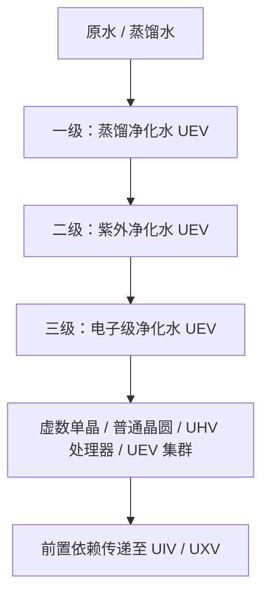

# 三级水质净化系统与工业水循环规范

GTECore 的 **三级水质净化体系整体属于 UEV 阶段**，为虚数系列关键产物提供第三级电子级净化水。一、二、三级表示处理工序和水质等级，并不是三个不同的电压时代。中枢、三级装置及控制仓均使用 UEV 部件、电路和制造电压，三阶段净化与 EDI 再生配方也统一使用 UEV 运行电压。

整套产线由 **一台中枢净化水厂 + 三台分阶净化装置** 组成，采用 GTNH / GTO 同款的「中枢统管」设计：各级净化装置自身没有能源仓，必须用数据棒连接到中枢，由中枢统一供电并下发并行度。

---

## 💧 三级净化水流体体系

| 注册流体 | 材质命名 (Lang) | 颜色质感 | 现实工业对标 | 关键水质指标 | 准入科技阶梯 |
| :--- | :--- | :--- | :--- | :--- | :---: |
| `distilled_purified_water` | **§3蒸馏净化水** | `0x4A94FF` (湖水蓝) | 工业高纯多效热精馏水 | 电阻率 $> 1\ \text{M}\Omega\cdot\text{cm}$ $\text{TOC} < 50\ \text{ppb}$ | **UEV 阶** |
| `uv_purified_water` | **§9紫外净化水** | `0x7B68EE` (紫外罗兰蓝) | 深紫外高能光催化超净水 | 电阻率 $> 10\ \text{M}\Omega\cdot\text{cm}$ $\text{TOC} < 1\ \text{ppb}$ | **UEV 阶** |
| `ultrapure_water` | **§b电子级净化水** | `0x80D8FF` (极纯天蓝) | SEMI E-1.1 级电子级超纯水 (UPW) | 电阻率 $= 18.2\ \text{M}\Omega\cdot\text{cm}$ $\text{TOC} < 0.05\ \text{ppb}$ | **UEV 阶** |

水质指标是工艺背景说明；游戏中的实际行为由配方、温控、紫外剂量和 EDI 负载机制决定。

---

## 🏭 四台多方块设备

| 机器 | 注册 ID | 科技阶段 |
| :--- | :--- | :---: |
| **中枢净化水厂** | `central_water_purification_plant` | UEV |
| **一级澄清净化装置** | `t1_clarifier_purification_unit` | UEV |
| **二级紫外氧化净化装置** | `t2_uv_oxidation_purification_unit` | UEV |
| **三级 EDI 超纯净化装置** | `t3_edi_ultrapure_purification_unit` | UEV |

> 旧的 `ultrapure_water_refinery`（超纯水综合精炼中心）仅保留兼容注册，已停用，不能继续运行完整净化链条；请迁移到中枢与三级装置。

### 1. 中枢净化水厂（Central Water Purification Plant）

整条产线的控制与供电核心，自身不执行净化配方，只做三件事：

1. **连接**：用数据棒把各级净化装置绑定到中枢（详见下方操作方式），绑定关系持久化保存；
2. **供电**：把中枢能源仓中的电力实时转发给所有已连接且已成型的净化装置，并在 GUI 中显示实际输出功率（EU/s）；
3. **下发并行**：GUI 中设定的并行度会广播给全部已连接装置，作为它们的并行上限。

未连接中枢（或中枢未成型）的净化装置无法开机，GUI 会给出红色提示。

### 2. 一级澄清净化装置（UEV 阶）

- **反应原理**：利用差压闪蒸技术降低水的沸点，瞬间蒸发纯水蒸汽并与重金属离子和无机盐分离，通过气液分离捕滴板冷凝收集纯相，并脱除游离氧与二氧化碳气体。
- **工艺流**：
  - 普通水 1000 mB + 复合絮凝剂 50 mB + 改性碳微球 1 个 → 蒸馏净化水 900 mB / 60 t，概率副产盐粉与稀土粉
  - 蒸馏水 1000 mB + 复合絮凝剂 25 mB + 改性碳微球 1 个 → 蒸馏净化水 1000 mB / 30 t，概率副产盐粉
- **性能特点**：作为 UEV 净化链条的入口；实际水产量还受温控稳定度影响，以上为配方标称值。

### 3. 二级紫外氧化净化装置（UEV 阶）

- **反应原理**：采用深紫外（DUV）光源辐射流体，断开水中长链微量有机化合物化学键；辅以强氧化剂在紫外光催化下激发出高氧化电位自由基，快速将总有机碳（TOC）和胶体微生物矿化分解。
- **工艺流**：
  - 蒸馏净化水 800 mB + 臭氧 50 mB → 紫外净化水 800 mB + 氧气 25 mB / 40 t
  - 蒸馏净化水 800 mB + 过氧化氢 50 mB → 紫外净化水 800 mB + 氧气 25 mB / 20 t（快速 AOP 路线）；两条路线还必须满足紫外剂量要求
- **性能特点**：水中有机碳含量暴降至 1 ppb 以下，达到微纳芯片光刻与生物洁净室级标准。

### 4. 三级 EDI 超纯净化装置（UEV 阶）

- **反应原理**：在强直流电场作用下，通过交替排列的离子交换选择性透过膜，强行将水中残留的硅酸根、硼酸根等弱电解质阴阳离子全部定向驱离；游戏中需要电子级酸碱试剂与混床树脂珠，并通过独立再生配方清除积累的离子负载。
- **工艺流**：
  - 紫外净化水 800 mB + 电子级酸碱试剂 20 mB + 混床树脂珠 1 个 → 电子级净化水 800 mB / 30 t
  - EDI 再生：紫外净化水 100 mB + 电子级酸碱试剂 1 mB / 2 t，仅清除离子负载，不产水
- **性能特点**：水电阻率达到理论绝缘极值 $18.2\ \text{M}\Omega\cdot\text{cm}$，是超晶格芯片加工、虚数工程不可替代的终极流体。

---

## 🔌 数据棒连接与运行方式

1. **复制中枢坐标**：潜行 + 右键中枢净化水厂（手持 GT 数据棒），聊天栏提示「已复制中枢净化水厂坐标」；
2. **绑定净化装置**：手持该数据棒右键任意一台分阶净化装置，提示「已连接中枢净化水厂」；
   - 反向操作同样有效：潜行 + 右键净化装置复制其坐标，再右键中枢即可连接。
3. **接入电力**：给中枢安装能源仓（1–4 个，支持激光仓），中枢会把电力转发给所有已连接装置；
4. **设定并行**：打开中枢 GUI，在底部「并行度」输入框设定并行上限（1 ~ 65536），所有已连接装置立即生效；
5. **查看状态**：净化装置 GUI 会显示所连中枢坐标、中枢下发的并行度与自身内部电力缓冲。

### 供电与并行的关系

- 每台净化装置的耗电 = 配方耗电 × 实际并行度，电力全部由中枢提供；
- 三台装置的电力上限均为 `UEV 电压 × 256 A`；一、二、三级表示处理工序，不代表不同的运行电压或解锁阶段；
- 实际并行度还受 **输入仓中的原料量** 与 **输出仓剩余容量** 限制，因此需要按目标吞吐配置足够大的输入/输出仓；
- 中枢 GUI 中把并行度调得再高，超出电力与仓容的部分也不会生效——这与 GTNH 净水厂「并行不足多为电力不足」的现象一致。

---

## 🔄 虚数系列下游与启动顺序

第三级电子级净化水（`ultrapure_water`）用于以下虚数之树配方；数量均为每批配方的直接消耗：

| 产物 | 每批产量 | 电子级净化水 |
| :--- | ---: | ---: |
| 虚数单晶 | 4 个 | 4000 mB |
| 普通虚数晶圆 | 16 片 | 1000 mB |
| UHV 虚数处理器 | 4 个 | 1000 mB |
| UEV 虚数处理器集群 | 2 个 | 2000 mB |

UIV 虚数超级计算机与 UXV 虚数主机不额外直接耗水，但通过 UEV 集群等前置产物继承净水依赖。产物的电路等级与其配方电压不改变净水体系整体 UEV 的定位。

启动顺序是 **UHV 部件 + 阴阳路线 → UEV 八部件 → UEV 净水设备 → 三级电子级净化水 → 虚数关键产物**。UEV 八部件由整合包新增的 UEV 部件配方提供；阴阳配方和这些部件配方不直接消耗电子级净化水，避免净水设备依赖自己的产物才能制造。

虚数结构材料、首树制造和单晶/普通晶圆路线已接通，详见[虚数基础材料与首棵虚数之树](circuits-and-materials.md)。生长介质在赤阳道核中每批消耗电子级净化水 4000 mB，产出 32 个；叶矩阵是固定结构，树内单晶生产持续消耗生长介质。

**虚数浸没光刻中心**继续消耗第三级电子级净化水，以专用配方加工普通虚数晶圆。CPU 晶圆、粗制芯片、刻模芯片、电路芯片和 CPU 芯片五道工序均已接通，全部运行于 UEV；每批直接耗水分别为 **2000、1000、500、1000、500 mB**。曝光和刻模使用可重复使用、不消耗的阴阳透镜。两条分支及完整物料用量见[虚数浸没光刻中心](circuits-and-materials.md)。控制器以阴阳 UIV 电路和普通虚数晶圆启动，不依赖本机芯片产物。

### 虚数基板封装厂

[虚数基板封装厂](circuits-and-materials.md)以光刻中心产出的 CPU 芯片、电路芯片，以及前代 UIV 电路和 UEV 部件启动，不依赖自身产出的基板或 SoC。三道工序均使用 UEV：

| 工序产物 | 每批产量 | 直接电子级净化水 | 基础时间 |
| :--- | ---: | ---: | ---: |
| 虚数之树电路基板 | 4 | 2000 mB | 30 秒 |
| 虚数之树印刷电路基板 | 1 | 1000 mB | 20 秒 |
| 虚数之树 SoC | 2 | 2000 mB | 30 秒 |

基板、印刷板、SoC 与四档成品电路的配方链已接通。四档成品仍由虚数之树以 **UEV 制造电压**产出，每批分别为 **4 / 2 / 1 / 1**；其 **UHV / UEV / UIV / UXV 电路标签**保持不变。UIV 与 UXV 通过前置产物间接耗水。

星刃蚀刻仪、电路工厂的降级水回收、矿石处理额外收益等下游方案尚未实现，不能作为当前可用功能；也没有已实现的 90% 回收闭环。
