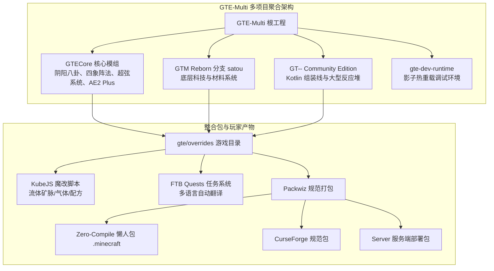

# GregTech Easy (GTE) 官方文档

欢迎查阅 **GregTech Easy (GTE)** 整合包官方全方位指南！

GTE 是一个以 **“简单、好玩、有趣、耗时短”** 为核心理念的现代 Minecraft 1.20.1 整合包。

---

## 🧭 架构导览图

---

## ⚡ 快速跳转索引

-   :material-download: __[玩家与整合包指南](download-and-play/lazy-pack.md)__

    ---

    下载开箱即用的 **0 编译完整懒人包**、CurseForge 规范包与服务端，了解 **Java 21** 运行环境配置与启动器导入教程。

    [:octicons-arrow-right-24: 立即前往](download-and-play/lazy-pack.md)

-   :material-chip: __[GTECore 核心模组详解](gtecore/overview.md)__

    ---

    深入了解 **阴阳八卦炼仙炉**、**四象阵法**、**矿石处理中心**、**奇迹之环**、**超弦与阴阳电路**、**AE2 样板总成 Plus** 等核心内容。

    [:octicons-arrow-right-24: 立即前往](gtecore/overview.md)

-   :material-cog: __[GTM Reborn 模组分支](gtm-reborn/index.md)__

    ---

    了解 `satou` 分支带来的多安培配方、批处理模式、1t Subtick 超频、GameTest 自动化测试以及流体区间输出特性。

    [:octicons-arrow-right-24: 立即前往](gtm-reborn/index.md)

-   :material-code-tags: __[KubeJS 魔改与开发工具](kubejs/scripting-guide.md)__

    ---

    学习如何在 KubeJS 中注册材料、编写配方，并使用内置的 `/dumpmultiblock` 木斧框选工具一键导出多方块结构代码。

    [:octicons-arrow-right-24: 立即前往](kubejs/scripting-guide.md)

-   :material-hammer-wrench: __[开发者与防崩溃实战手册](development/quick-start.md)__

    ---

    掌握 `run_game.bat` 免启动器秒级启动、`link_to_launcher.bat` 零复制目录映射，以及杜绝 Mixin Accessor 崩溃的黄金守则。

    [:octicons-arrow-right-24: 立即前往](development/quick-start.md)

-   :material-robot: __[CI/CD 流水线与 AI 翻译](ci-cd-and-translation/ci-pipeline.md)__

    ---

    了解基于 GitHub Actions 的自动化多模块并行构建、Packwiz 打包、Maven 发布以及 `opencode_translate.py` AI 国际化脚本。

    [:octicons-arrow-right-24: 立即前往](ci-cd-and-translation/ci-pipeline.md)

---

## 🛠️ 项目基础信息

| 配置项 | 说明 |
| :--- | :--- |
| **项目名称** | `GregtechEasy` (`gte-multi`) |
| **运行与编译工具链** | **JDK 21**（强制使用 Java 21 Toolchain，所有子模块严格统一） |
| **游戏版本** | Minecraft `1.20.1` (Forge `47.3.0` / `47.4.4`) |
| **开源许可证** | LGPL-3.0 / MIT |
| **默认分支** | 主仓库 `main` / `master`，GTM-Reborn `satou`，GT-- `kotlin`，GTECore `master` |
